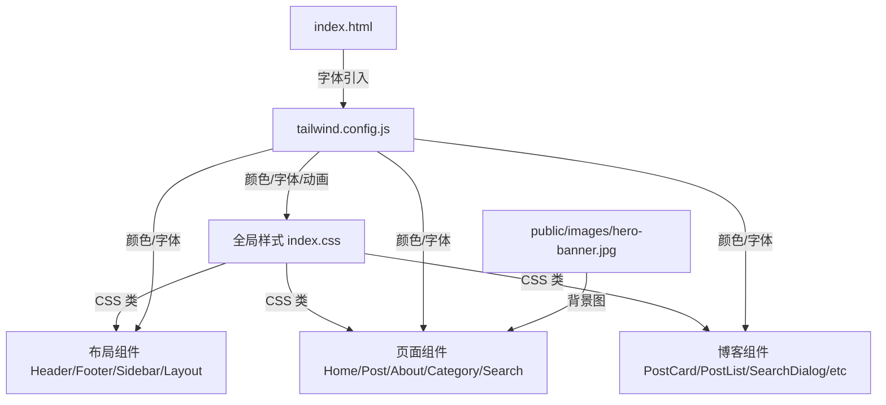

## 用户需求

用户对上一轮的网站改版提出两个问题：

1. **封面图片未生效**：用户发送了一张二次元角色群像图（暗色背景、菱形光效、多角色群像），希望作为网站首页 Hero 区域的背景大图。但上一轮错误地将文章 cover 字段指向了 `image14.png`（工具截图），未使用用户提供的图片。
2. **风格不够二次元**：当前网站偏赛博朋克/像素游戏风，用户希望更加日本动漫风格，融合鸣潮、原神、边狱巴士、废墟图书馆、明日方舟等二次元游戏的视觉元素。

## 产品概述

将 BinaryBard Blog 从赛博朋克像素风格全面重设计为日本二次元动漫 UI 风格。首页 Hero 区使用用户提供的二次元角色群像图作为大背景，全站 UI 面板采用毛玻璃半透明效果、温暖的金色/琥珀色点缀、柔和紫蓝渐变，装饰使用对角线条纹和菱形几何元素。

## 核心功能

1. **Hero 区域二次元大图背景**：首页 Hero 区使用用户提供的动漫角色群像图作为全幅背景，覆盖半透明渐变叠层，文字信息浮于其上
2. **全站动漫 UI 面板风格**：所有卡片/面板从像素直角边框改为毛玻璃半透明面板 + 圆角 + 对角线装饰线条，参考原神/鸣潮游戏 UI
3. **配色体系升级**：从霓虹粉青色系改为深蓝底色 + 金色/琥珀色主色 + 柔和的紫蓝渐变点缀，更接近日本动漫游戏的温暖感
4. **字体去像素化**：移除 Press Start 2P 像素字体，改用 ZCOOL KuaiLe 作为装饰字体，Noto Sans SC 作为正文字体
5. **装饰效果升级**：移除扫描线/像素网格，改为对角线条纹、菱形元素、发光粒子、几何装饰线（参考明日方舟/Project Moon 游戏 UI）
6. **动画效果调整**：保留浮动效果，增加柔和呼吸灯/shimmer 光效，移除像素闪烁/故障效果

## 技术栈

- 前端框架：React 18 + TypeScript（不变）
- 构建工具：Vite 5（不变）
- 样式方案：Tailwind CSS 3.4 + tailwindcss-animate（不变）
- 组件库：shadcn/ui（不变）
- 图标：lucide-react（不变）

## 实现方案

### 策略概述

采用「配色/字体基础层 -> CSS 装饰层 -> 组件层」的分层改造方式。先更新 tailwind.config.js 的颜色/字体/动画体系，再重写 index.css 的全局装饰效果和 prose 样式，最后逐一改造各页面和组件的 className。所有改动保持在同一暗色主题基础上，仅替换色板和装饰风格。

### 关键技术决策

1. **配色方案**：

- 背景色从 `#0a0a1a`（纯黑蓝）调整为 `#0b0e1a`（深海蓝），更温暖
- 主色从紫粉霓虹改为金色/琥珀色系（`#d4a44c` / `#f0c66e`），参考原神 UI 的金色边框
- 强调色从 neon-cyan 改为柔和的天蓝（`#7eb8da`），参考鸣潮 UI
- 辅色保留紫色系但降低饱和度（`#9b8ec4`），参考明日方舟的灰紫色调
- 危险/醒目色使用深红（`#c45c5c`），参考 Project Moon 的红色调

2. **字体方案**：

- 移除 Press Start 2P（像素字体），保留 ZCOOL KuaiLe 作为 Logo/装饰用字体
- 正文保留 Noto Sans SC，代码保留 JetBrains Mono
- 新增 Noto Serif SC 用于文章标题，增加日系文艺感

3. **面板/卡片风格**：

- 使用 `backdrop-filter: blur()` 的毛玻璃效果替代纯色 pixel-card 背景
- 边框从直角实线改为细金色半透明边框 + 圆角
- 角落装饰从像素直角改为斜切菱形或对角线段
- hover 效果从像素阴影改为柔和的金色 glow

4. **装饰效果**：

- 移除 `.pixel-grid`、`.scan-lines`、`.pixel-border`、`.rpg-corners`
- 新增 `.anime-panel`（毛玻璃面板）、`.diagonal-stripe`（对角条纹装饰）、`.diamond-corner`（菱形角装饰）
- 新增 `.shimmer`（shimmer 光效动画）、`.breath-glow`（呼吸灯效果）

5. **Hero 区域**：

- 使用用户提供的二次元角色群像图作为全幅背景（CSS background-image）
- 叠加深色渐变遮罩确保文字可读性
- 右侧终端模拟器改为「角色卡片」风格的个人信息面板

## 实现备注

- 所有 `font-pixel` 的 className 引用需全部替换或移除
- 所有 `pixel-card`、`pixel-border`、`pixel-border-glow`、`scan-lines`、`stars-bg`、`rpg-corners` 的 CSS class 需要替换为新的动漫风装饰 class
- `neon-pink`、`neon-cyan` 等颜色名在 tailwind config 中会被重新定义为新色值，所以组件中使用这些名字的地方不需要逐一替换 class name，只需要在 config 中更新色值即可
- 但语义不合的地方（如 `pixel-card`、`pixel-border`、`pixel-darker` 等）需要替换为新的语义名

## 架构设计

架构不变，仅修改视觉层。数据流、路由、状态管理全部保持原样。



## 目录结构

```
i:\Project\BinaryBardBlog\
├── public/
│   └── images/
│       └── hero-banner.jpg              # [NEW] 用户提供的二次元角色群像图，用作首页 Hero 大背景
├── index.html                           # [MODIFY] 更新 Google Fonts 引入：移除 Press Start 2P，新增 Noto Serif SC；更新 body class 底色
├── tailwind.config.js                   # [MODIFY] 全面重写颜色体系（anime 替代 pixel/neon）、字体（移除 pixel）、动画（移除 pixelBlink/scanLine/glitch，新增 shimmer/breathGlow）、阴影
├── src/
│   ├── index.css                        # [MODIFY] 全面重写：移除 pixel-grid/scan-lines/pixel-border/rpg-corners，新增 anime-panel/diagonal-stripe/diamond-corner/shimmer/breath-glow；重写 prose 样式为金色系；重写滚动条样式
│   ├── pages/
│   │   ├── HomePage.tsx                 # [MODIFY] Hero 区改为二次元大图背景 + 渐变遮罩 + 毛玻璃信息面板；内容区标题装饰改为金色系
│   │   ├── PostPage.tsx                 # [MODIFY] 文章头部背景改为柔和渐变 + 几何装饰；移除 pixel 相关 class
│   │   ├── AboutPage.tsx                # [MODIFY] 头像从像素多边形改为圆形 + 金色边框；面板改为毛玻璃风格
│   │   ├── CategoryPage.tsx             # [MODIFY] 页面标题和面板改为动漫 UI 风格
│   │   └── SearchPage.tsx               # [MODIFY] 搜索输入框和结果卡片改为毛玻璃面板
│   ├── components/
│   │   ├── layout/
│   │   │   ├── Header.tsx               # [MODIFY] Logo 从像素多边形改为圆形金边；导航激活态改为金色下划线；移除 font-pixel
│   │   │   ├── Footer.tsx               # [MODIFY] Logo 和标题改为金色系；移除 font-pixel；社交图标改为金色边框
│   │   │   └── Sidebar.tsx              # [MODIFY] 所有面板改为毛玻璃风格；标题从 font-pixel 改为正常字体 + 金色装饰
│   │   └── blog/
│   │       ├── PostCard.tsx             # [MODIFY] 卡片改为毛玻璃面板 + 金色边框 hover；移除像素角装饰
│   │       ├── PostList.tsx             # [MODIFY] 分页按钮改为金色系圆角按钮；移除 font-pixel
│   │       ├── SearchDialog.tsx         # [MODIFY] 对话框改为毛玻璃面板；移除像素角装饰和 font-pixel
│   │       ├── CategoryList.tsx         # [MODIFY] 分类标签改为金色系圆角按钮
│   │       ├── TableOfContents.tsx      # [MODIFY] 目录面板改为毛玻璃风格
│   │       ├── RelatedPosts.tsx         # [MODIFY] 相关文章卡片改为毛玻璃风格
│   │       └── Comments.tsx             # [MODIFY] 评论区分隔线和标题改为动漫风格色系
└── content/
    └── posts/
        └── ability-editor-helper.md     # [MODIFY] 保持 cover 字段不变（指向 image14.png 作为文章封面缩略图）
```

## 设计风格

采用日本二次元动漫游戏 UI 风格，融合多款知名二次元游戏的视觉语言：

### 整体氛围

深邃的夜空蓝底色，配合温暖的金色/琥珀色边框和装饰线条。面板采用毛玻璃半透明效果，仿佛游戏中的 HUD 界面浮于角色插画之上。整体给人一种沉稳而精致的日式幻想风。

### 首页 Hero 区域

全幅二次元角色群像图作为背景，覆盖从底部到顶部的深蓝渐变遮罩（底部 95% 不透明确保文字可读）。左侧是个人介绍文案，右侧是一个毛玻璃个人信息面板（仿游戏角色状态卡），面板带有金色细边框和对角线装饰。

### 卡片/面板设计

所有信息面板使用 `backdrop-filter: blur(12px)` 毛玻璃效果，背景色为 `rgba(11, 14, 30, 0.75)`，边框为细金色半透明线（`rgba(212, 164, 76, 0.25)`）。Hover 时边框亮度提升，底部出现柔和的金色投影光晕。四角可选添加菱形装饰元素。

### 交互效果

- 卡片 hover：微微上浮 + 金色边框渐亮 + 柔和发光
- 导航链接激活态：底部金色下划线 + 文字变为金色
- 按钮：圆角 + 金色渐变背景，hover 时 shimmer 光效扫过
- 标签/分类：圆角药丸形，半透明背景 + 金色/天蓝色文字

### 页面布局

- 首页：全幅 Hero（min-height 80vh）+ 双栏内容区（文章列表 + 侧边栏）
- 文章页：柔和渐变头部 + 文章正文 + 右侧目录
- 关于页：圆形头像 + 个人信息 + 技能网格 + 时间线
- 分类页：标签筛选栏 + 双栏文章列表
- 搜索页：居中搜索框 + 结果列表