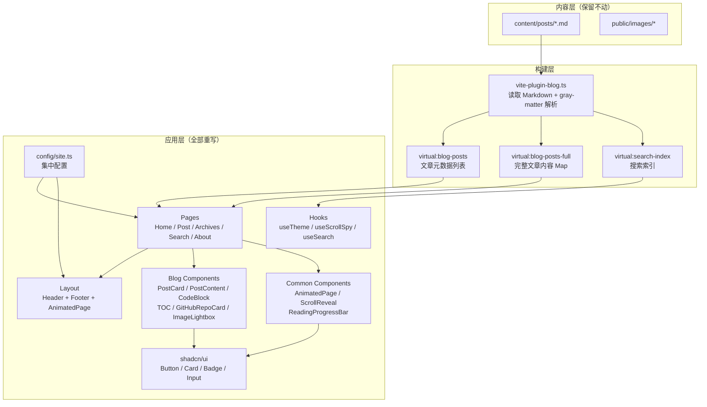

## 用户需求

完全重做 BinaryBardBlog 个人技术博客，不再沿用现有主题、风格、布局和技术栈。以 Mizuki（Material Design 3 风格 Astro 博客）和 leleo-home-page（简洁主义个人主页）两个参考项目为灵感来源，全新设计和开发博客。

## 产品概述

一个面向游戏开发者（BinaryBard）的个人技术博客，聚焦 Unreal Engine 与软件工程领域。以 Material Design 3 和简洁主义相融合的现代设计语言呈现，提供深色/浅色双主题、毛玻璃面板、流畅动画过渡、全文搜索、文章目录、代码高亮等功能。博客须完整保留现有两篇 Markdown 文章内容并正确渲染。

## 核心特征

1. **全新视觉设计**：融合 Material Design 3 的层次感与简洁主义的克制，采用毛玻璃面板、圆角卡片、柔和渐变背景、微动画交互，深色/浅色双主题切换
2. **首页**：全屏 Hero 区域（个人介绍 + 角色状态卡片 + 背景轮播/渐变），下方为文章列表（卡片式）+ 侧边栏（分类、标签云、最近文章）
3. **文章详情页**：阅读进度条、文章头部（分类/标题/描述/元信息）、正文（左）+ 浮动目录（右）、相关文章推荐、评论区
4. **归档页**：按年月时间线展示所有文章
5. **关于页**：个人简介、技能展示（进度条）、项目作品集（卡片网格）、个人时间线
6. **搜索功能**：全局搜索对话框（Ctrl+K 快捷键），支持标题和内容搜索
7. **Markdown 渲染**：支持 GFM 表格、代码高亮（带行号/复制按钮/语言标签）、图片灯箱、`[github-card:owner/repo](url)` 自定义语法渲染 GitHub 仓库卡片
8. **响应式布局**：桌面端双栏、平板端单栏、移动端全宽堆叠
9. **SEO 与 RSS**：Open Graph 元数据、RSS 订阅生成
10. **配置驱动**：站点信息、导航、社交链接、技能、项目等数据集中管理

## 技术栈

| 层级 | 技术选型 | 说明 |
| --- | --- | --- |
| 框架 | React 18 + TypeScript 5 | 保持 SPA 模式，组件化开发 |
| 构建 | Vite 5 | 快速 HMR，自定义博客插件 |
| 样式 | Tailwind CSS 3.4 + CSS Variables | 双主题系统，utility-first |
| UI 组件 | shadcn/ui (Radix) | 复用 Button/Card/Badge/Input/Separator |
| 动画 | framer-motion | 页面过渡、列表交错、滚动揭示、弹性进度条 |
| 路由 | React Router 6 | SPA 路由 |
| Markdown | react-markdown + remark-gfm + rehype-highlight + rehype-slug | 完整 Markdown 渲染管线 |
| 搜索 | flexsearch | 轻量级全文搜索 |
| 图标 | lucide-react + react-icons | 矢量图标库 |
| 代码字体 | JetBrains Mono | 等宽字体 |
| 部署 | CloudBase（cloudbaserc.json，产物 dist/） | 保持现有部署配置 |


## 实现方案

### 核心策略

在现有 React + Vite + Tailwind 技术基础上进行**全面重写**，保留构建体系（Vite 自定义博客插件 `vite-plugin-blog`、virtual module 机制）和内容层（`content/posts/`、`public/images/`），但完全重做所有 UI 组件、页面、样式和配置系统。新增 framer-motion 动画库、config 集中配置模块、AnimatedPage 页面过渡组件、ScrollReveal 滚动揭示组件、ImageLightbox 灯箱组件、ReadingProgressBar 阅读进度条组件、Archives 归档页面。

### 关键技术决策

1. **保留 Vite 插件架构**：`vite-plugin-blog.ts` 的 virtual module 系统（`virtual:blog-posts`、`virtual:blog-posts-full`、`virtual:search-index`）设计合理，在构建时读取 Markdown 并暴露给前端，支持 HMR。无需改动核心逻辑，仅增强 frontmatter 支持 `pinned` 字段。

2. **双主题 CSS Variables**：`:root` 定义浅色主题变量，`.dark` 定义深色主题变量。所有组件通过 Tailwind 的 CSS Variable 令牌系统引用颜色，避免硬编码。默认深色主题。

3. **framer-motion 动画层**：所有页面用 `<AnimatedPage>` 包裹实现入场/退场动画；列表用 `staggerChildren` 交错入场；卡片用 `whileHover` 微交互；技能进度条用 `spring` 弹性动画。尊重 `prefers-reduced-motion`。

4. **配置驱动**：新建 `src/config/site.ts` 集中管理所有站点数据（siteConfig、navLinks、socialLinks、skills、projects），页面和组件从配置读取，不硬编码。

5. **GitHub Card 渲染**：保留现有的 `[github-card:owner/repo](url)` 自定义 Markdown 语法解析逻辑（在 PostContent 的 `a` 组件自定义渲染器中匹配），但重新设计 GitHubRepoCard 组件的视觉样式以匹配新设计系统。

6. **图片灯箱**：新增 `ImageLightbox` 组件，通过 React Portal 渲染到 `document.body`，支持 ESC 关闭、点击遮罩关闭、缩放淡入淡出过渡。

7. **阅读进度条**：文章页顶部 2px 高的进度条，跟踪页面滚动位置，使用主题色渐变。

## 实现注意事项

- **内容层不动**：`content/posts/` 下两篇文章和 `public/images/` 下所有图片资源严禁修改或删除
- **部署配置不动**：`cloudbaserc.json` 保持不变，构建产物输出到 `dist/`
- **.codebuddy 目录不动**：`.codebuddy/` 目录完整保留
- **`prefers-reduced-motion` 适配**：所有 framer-motion 动画需检测并在用户偏好减少动画时降级
- **性能考量**：图片统一 `loading="lazy"`；代码块和灯箱组件按需懒加载；framer-motion 自动 tree-shake 未使用的 API
- **向后兼容**：图片路径保持 `/images/xxx` 格式（相对 `public/`），文章内引用无需修改

## 架构设计

### 系统架构



### 数据流

1. **构建时**：Vite 插件读取 `content/posts/*.md` → gray-matter 解析 frontmatter + content → 生成虚拟模块
2. **运行时**：页面组件导入虚拟模块获取文章数据 → 通过 react-markdown 渲染正文 → 自定义组件渲染器处理代码块、GitHub 卡片、图片灯箱等
3. **主题切换**：`useTheme` hook 管理 `localStorage` 持久化 + `document.documentElement.classList.toggle('dark')`
4. **搜索**：`useSearch` hook 基于 flexsearch 构建索引，SearchDialog 组件提供 UI

### 路由结构

| 路由 | 页面 | 说明 |
| --- | --- | --- |
| `/` | HomePage | 首页 Hero + 文章列表 |
| `/posts/:slug` | PostPage | 文章详情 |
| `/archives` | ArchivesPage | 时间线归档 |
| `/search` | SearchPage | 搜索结果 |
| `/about` | AboutPage | 关于页 |


## 目录结构

整体为全部重写，保留 `content/`、`public/`、`.codebuddy/`、`cloudbaserc.json`。以下列出所有需要创建或修改的文件：

```
f:/Project/BinaryBardBlog/
├── .codebuddy/                          # [PRESERVE] 不动
├── content/posts/                       # [PRESERVE] 两篇文章不动
│   ├── ability-editor-helper.md
│   └── turn-based-gas.md
├── public/images/                       # [PRESERVE] 所有图片不动
├── cloudbaserc.json                     # [PRESERVE] 部署配置不动
├── index.html                           # [MODIFY] 更新 HTML 模板：引入新字体（Noto Sans SC / Noto Serif SC / JetBrains Mono / ZCOOL KuaiLe）、更新 meta 标签、body class 适配双主题
├── package.json                         # [MODIFY] 添加 framer-motion 依赖，确保所有依赖完整
├── tailwind.config.js                   # [MODIFY] 完全重写：双主题色系（anime-* tokens）、字体族、动画 keyframes、阴影、border-radius 等
├── postcss.config.js                    # [PRESERVE] 不动
├── vite.config.ts                       # [MODIFY] 微调：确保 framer-motion 加入 manualChunks vendor 分组
├── tsconfig.json                        # [PRESERVE] 不动
├── tsconfig.app.json                    # [PRESERVE] 不动
├── tsconfig.node.json                   # [PRESERVE] 不动
├── components.json                      # [PRESERVE] shadcn 配置不动
├── scripts/
│   └── generate-rss.ts                  # [MODIFY] 更新站点 URL 和描述，保持 RSS 生成逻辑
├── src/
│   ├── main.tsx                         # [MODIFY] 入口文件，保持 React 18 createRoot 模式
│   ├── App.tsx                          # [MODIFY] 路由配置：新增 /archives 路由，使用 AnimatePresence 包裹
│   ├── index.css                        # [MODIFY] 完全重写：双主题 CSS Variables（:root 浅色 + .dark 深色）、全局样式、自定义滚动条、glassmorphism 工具类、Markdown prose 样式、highlight.js 覆盖
│   ├── vite-env.d.ts                    # [MODIFY] 添加 virtual module 类型声明
│   ├── config/
│   │   └── site.ts                      # [NEW] 集中配置文件。导出 siteConfig（站点元数据）、navLinks（导航项）、socialLinks（社交链接）、skills（技能列表含分类和熟练度）、projects（项目作品集含描述/标签/链接）。所有页面和布局组件从此处读取数据。
│   ├── types/
│   │   └── blog.ts                      # [MODIFY] 更新类型定义：PostMeta 增加 pinned 字段，新增 Skill/Project/NavLink/SocialLink 接口，移除旧 siteConfig 常量（迁移到 config/site.ts）
│   ├── plugins/
│   │   └── vite-plugin-blog.ts          # [MODIFY] 增强 frontmatter 解析：支持 pinned 字段、优化阅读时间算法（中文按字数计算）
│   ├── lib/
│   │   ├── utils.ts                     # [MODIFY] 保持 cn() 工具，更新 formatDate 支持更丰富格式
│   │   ├── posts.ts                     # [MODIFY] 保持核心逻辑（getCategories/getAllTags/filterByCategory/getRelatedPosts/paginatePosts），微调排序逻辑让 pinned 文章优先
│   │   ├── search.ts                    # [MODIFY] 保持 flexsearch 搜索逻辑
│   │   └── toc.ts                       # [MODIFY] 保持目录提取逻辑
│   ├── hooks/
│   │   ├── useTheme.ts                  # [MODIFY] 重写主题 hook：支持 dark/light/system 三种模式，localStorage 持久化，监听 prefers-color-scheme 变化
│   │   ├── useScrollSpy.ts              # [MODIFY] 保持滚动监听逻辑，适配新 TOC 组件
│   │   └── useSearch.ts                 # [MODIFY] 保持搜索 hook 逻辑
│   ├── components/
│   │   ├── layout/
│   │   │   ├── Layout.tsx               # [MODIFY] 布局外壳：Header + main（AnimatePresence 包裹 Outlet）+ Footer + SearchDialog
│   │   │   ├── Header.tsx               # [MODIFY] 顶部导航栏：毛玻璃效果、Logo、导航链接、主题切换按钮、搜索按钮、移动端汉堡菜单
│   │   │   ├── Footer.tsx               # [MODIFY] 页脚：社交链接、版权信息、RSS 链接
│   │   │   └── Sidebar.tsx              # [MODIFY] 侧边栏：分类列表、标签云、最近文章
│   │   ├── blog/
│   │   │   ├── PostCard.tsx             # [MODIFY] 文章卡片：水平布局（封面左 + 内容右），支持 pinned 标记，glassmorphism 面板，hover 浮起 + 边框发光
│   │   │   ├── PostList.tsx             # [MODIFY] 文章列表：staggerChildren 交错入场动画
│   │   │   ├── PostContent.tsx          # [MODIFY] Markdown 渲染器：保持自定义组件渲染器（代码块/GitHub 卡片/图片灯箱），更新样式适配新主题
│   │   │   ├── CodeBlock.tsx            # [MODIFY] 代码块：语言标签、复制按钮（带成功反馈）、行号、超长折叠/展开
│   │   │   ├── GitHubRepoCard.tsx       # [MODIFY] GitHub 仓库卡片：重新设计视觉样式匹配新主题，保持 owner/repo/href 接口
│   │   │   ├── TableOfContents.tsx      # [MODIFY] 浮动目录：当前标题高亮，平滑滚动跳转
│   │   │   ├── RelatedPosts.tsx         # [MODIFY] 相关文章推荐：小型卡片网格
│   │   │   ├── Comments.tsx             # [MODIFY] 评论区：Giscus 集成或占位
│   │   │   ├── SearchDialog.tsx         # [MODIFY] 搜索对话框：Ctrl+K 唤出，实时搜索，结果列表
│   │   │   ├── CategoryList.tsx         # [MODIFY] 分类列表组件
│   │   │   └── TagCloud.tsx             # [MODIFY] 标签云组件
│   │   ├── common/
│   │   │   ├── AnimatedPage.tsx         # [NEW] 页面过渡动画容器。使用 framer-motion 实现 opacity: 0→1 + y: 20→0 的入场动画，duration 0.5s。所有页面组件用此包裹。
│   │   │   ├── ScrollReveal.tsx         # [NEW] 滚动揭示组件。使用 Intersection Observer + framer-motion 实现元素进入视口时的渐入动画。支持 threshold/delay/direction 等 props。
│   │   │   ├── ReadingProgressBar.tsx   # [NEW] 阅读进度条。固定于页面顶部，2px 高度，监听滚动位置计算进度百分比，使用主题色渐变（gold→sky）。
│   │   │   └── ImageLightbox.tsx        # [NEW] 图片灯箱组件。通过 React Portal 渲染到 body，支持 ESC 关闭、遮罩点击关闭、缩放+淡入淡出过渡动画。PostContent 中的 img 组件渲染器调用此组件。
│   │   └── ui/                          # [PRESERVE] shadcn/ui 组件保持不动
│   │       ├── badge.tsx
│   │       ├── button.tsx
│   │       ├── card.tsx
│   │       ├── input.tsx
│   │       └── separator.tsx
│   └── pages/
│       ├── HomePage.tsx                 # [MODIFY] 首页：全屏 Hero（个人介绍 + 角色卡片 + 渐变背景粒子效果）+ 文章列表（带 Sidebar 双栏）
│       ├── PostPage.tsx                 # [MODIFY] 文章详情：ReadingProgressBar + 文章头部 + PostContent（左）+ TOC（右 sticky）+ RelatedPosts + Comments
│       ├── ArchivesPage.tsx             # [NEW] 归档页。时间线布局：年份大标题（金色）在左，文章节点在右，连接线贯穿。每个节点展示日期+标题+分类徽章。ScrollReveal 滚动入场动画。
│       ├── SearchPage.tsx               # [MODIFY] 搜索页面：搜索结果展示
│       ├── AboutPage.tsx                # [MODIFY] 关于页：个人简介区 + 技能网格（进度条带 spring 动画）+ 项目作品集（卡片网格）+ 个人时间线
│       └── CategoryPage.tsx             # [MODIFY] 分类页面：按分类筛选文章
```

## 关键代码结构

```typescript
// src/config/site.ts - 集中配置接口
export interface SiteConfig {
  title: string
  description: string
  author: string
  url: string
  github: string
  email: string
  avatar?: string
}

export interface NavLink {
  label: string
  path: string
  icon?: string
}

export interface Skill {
  name: string
  category: string
  level: number // 0-100
}

export interface Project {
  title: string
  description: string
  tags: string[]
  link?: string
  github?: string
  cover?: string
}
```

## 设计风格

融合 Material Design 3 的层次结构与空间感，以及简洁主义的内容聚焦美学。以深邃的星空暗色为基底，金色与天蓝色为点缀，营造出兼具科技感与温暖质感的赛博朋克动漫风格。支持深色/浅色双主题。

## 全局设计规范

- **背景**：深色主题以深蓝黑（#0B0E1A）为底，叠加微弱的金色、天蓝、薰衣紫径向渐变光晕；浅色主题以暖白纸质（#F8F6F1）为底
- **面板**：采用 Glassmorphism（毛玻璃）效果，半透明背景 + backdrop-blur + 1px 细边框（金色低透明度），hover 时边框增亮 + 阴影扩散
- **圆角**：统一 0.75rem（12px），卡片和面板使用较大圆角营造柔和感
- **阴影**：深色主题使用带金色色调的微光阴影（box-shadow: 0 0 15px rgba(212,164,76,0.08)），浅色主题使用标准中性阴影
- **装饰元素**：钻石角标（45 度旋转小方块）、对角线条纹、呼吸发光脉冲
- **动画**：页面切换 opacity+translateY 0.5s；卡片 hover translateY(-4px) 0.3s；列表交错入场 staggerChildren 0.1s；技能进度条 spring 弹性动画；滚动条使用金紫渐变
- **响应式**：lg(1024px+) 双栏带侧边栏和浮动 TOC；md(768px) 单栏侧边栏下沉；sm(<768px) 全宽堆叠、汉堡菜单

## 页面设计

### 1. 首页（HomePage）

- **Hero 区块**：全屏高度，背景使用英雄横幅图片 + 多层渐变叠加（从上到下/从左到右的暗色渐变），散布微小金色/天蓝浮动粒子。左侧展示标签徽章（Game Developer）、大标题（Hi, 我是 BinaryBard，金色渐变文字）、简介描述、GitHub/联系我按钮。右侧展示角色状态卡片（头像、姓名、属性列表：引擎/语言/方向，glassmorphism 面板 + 钻石角标 + 呼吸发光）
- **滚动提示**：底部居中向下箭头 + "向下滚动" 文字
- **文章列表区**：双栏布局，左侧文章列表（PostCard 垂直排列，交错入场），右侧 sticky 侧边栏（分类/标签云/最近文章）
- **区域标题**：左侧金色竖条 + 标题文字 + 右侧文章计数

### 2. 文章详情页（PostPage）

- **阅读进度条**：固定顶部 2px，gold→sky 渐变色，跟随滚动
- **文章头部**：深色面板背景 + 微光效果，展示返回链接、分类徽章、大标题（衬线体）、描述、元信息（日期/阅读时间/标签）
- **正文区域**：左侧 Markdown 渲染内容（自定义 prose 样式），右侧浮动 TOC（sticky，当前标题高亮金色）
- **代码块**：深色背景 + 金色细边框，右上角语言标签 + 复制按钮，行号显示
- **GitHub 卡片**：glassmorphism 面板，GitHub 图标 + owner/repo + 外链箭头，hover 边框发光
- **图片**：圆角 + 金色细边框 + 阴影，点击打开灯箱
- **相关文章**：底部小型卡片网格
- **评论区**：Giscus 集成区域

### 3. 归档页（ArchivesPage）

- **时间线布局**：左侧年份大标题（金色粗体），右侧文章节点沿垂直线排列
- **连接线**：1px 金色低透明度竖线贯穿
- **节点**：圆点标记 + 日期 + 文章标题 + 分类徽章，hover 高亮
- **滚动入场**：每个节点使用 ScrollReveal 渐入

### 4. 搜索页（SearchPage）

- **搜索框**：居中大尺寸输入框，glassmorphism 背景
- **结果列表**：匹配文章以简洁卡片展示，高亮匹配关键词

### 5. 关于页（AboutPage）

- **个人简介区**：头像 + 姓名 + 头衔 + 简介文本 + 社交链接按钮
- **技能展示区**：分类网格（引擎/语言/工具），每个技能带进度条（spring 动画从 0 到目标值）
- **项目作品集**：卡片网格，每张卡片含封面、标题、描述、技术标签、链接按钮
- **个人时间线**：垂直时间线，关键里程碑节点

## Agent Extensions

### Skill

- **binary-bard-blog-dev**
- Purpose: 在重写所有 UI 组件和页面时，参考此 skill 中定义的设计系统规范（色彩令牌、字体体系、动画约定、组件模式、页面布局标准、Markdown 渲染约定），确保新实现严格遵循项目的开发指南
- Expected outcome: 所有重写的组件和页面符合 skill 中定义的设计系统、动画规范、配置驱动架构和组件模式要求

### SubAgent

- **code-explorer**
- Purpose: 在实现过程中需要跨多文件搜索现有模式、确认依赖关系、定位需要修改的代码位置时使用
- Expected outcome: 准确定位所有需要修改的文件和代码段，确保不遗漏关联修改