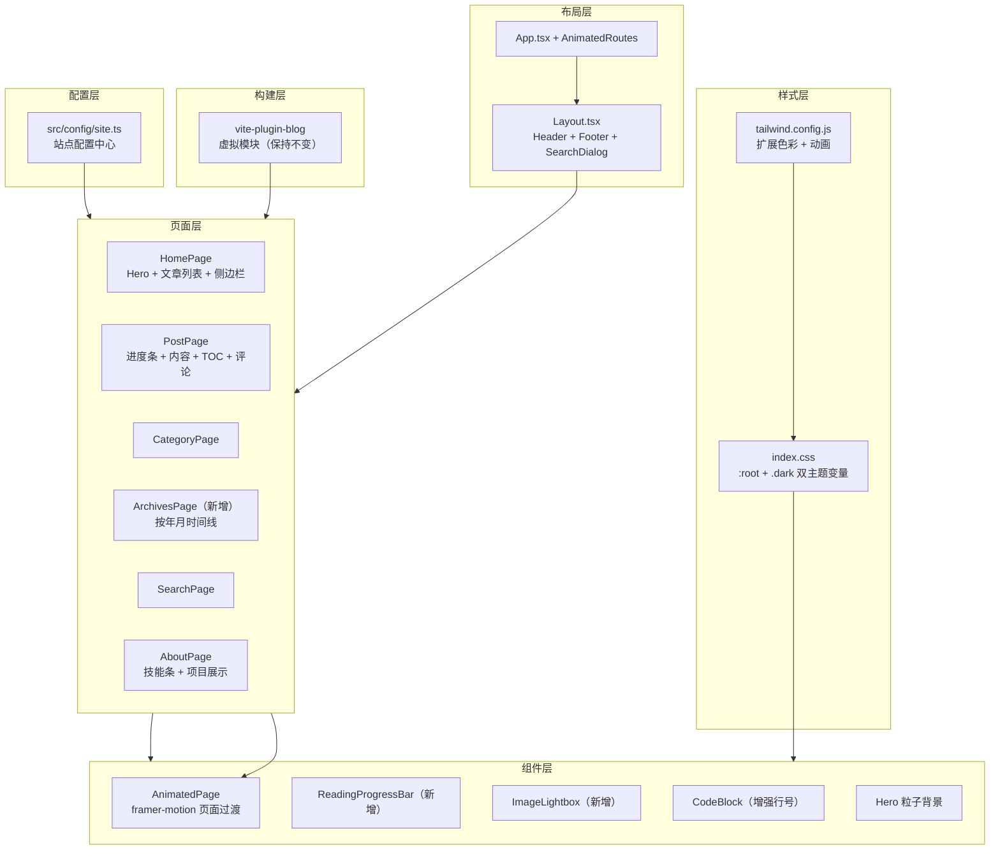

## 用户需求

用户希望参考两个优秀项目（Mizuki 和 leleo-home-page），将学到的设计理念和功能模式生成为本博客的 AI Skill，并据此对当前 BinaryBardBlog 个人博客进行全面迭代升级。必须保留已有的 2 篇文章（ability-editor-helper.md 和 turn-based-gas.md），其余架构和代码均可重构。

## 产品概述

BinaryBardBlog 是一个面向游戏开发者的个人技术博客，当前使用 React + TypeScript + Vite + Tailwind CSS + shadcn/ui 构建，采用暗色动漫金色主题。本次迭代旨在借鉴 Mizuki（Material Design 3 风格、页面过渡动画、全屏背景轮播、双栏布局、丰富页面类型）和 leleo-home-page（简洁主义、个人信息展示、配置驱动、背景壁纸系统）的优秀实践，对博客进行视觉与功能全面升级。

## 核心功能

1. **全新设计系统迭代**：重新设计色彩系统、字体系统和动画体系，采用更具辨识度的暗色赛博朋克与动漫美学融合风格，引入完善的亮/暗双主题切换，全局过渡动画
2. **首页升级**：全屏 Hero 区域采用视差滚动与粒子动画背景，个人角色状态卡片升级为更沉浸的交互式组件，文章列表支持置顶文章展示
3. **增强文章阅读体验**：文章详情页支持阅读进度条、TOC 自动高亮平滑跟踪、代码块增强（行号显示、多主题）、图片点击放大画廊效果
4. **新增归档页面**：按年月时间线展示所有文章，配合动画效果
5. **关于页全面升级**：借鉴 leleo-home-page 的卡片式项目展示和技能进度条设计，增加个人作品集 Showcase 区域
6. **配置驱动架构**：抽取全站配置到统一配置文件（站点信息、导航、社交链接、技能数据、项目展示等），便于后续维护
7. **性能与体验优化**：路由切换过渡动画、滚动动画（Intersection Observer）、图片懒加载优化、搜索体验增强

## 技术栈

沿用当前项目技术栈，不引入新框架：

- **前端框架**：React 18 + TypeScript
- **构建工具**：Vite 5
- **样式系统**：Tailwind CSS 3.4 + CSS Variables（亮暗双主题）
- **UI 组件库**：shadcn/ui（继续复用现有 Button/Card/Badge/Input/Separator）
- **图标库**：lucide-react（已有，继续使用）
- **路由**：React Router 6
- **Markdown 渲染**：react-markdown + remark-gfm + rehype-highlight + rehype-slug
- **新增依赖**：framer-motion（页面过渡动画+微交互）

## 实现方案

### 整体策略

在保持当前 Vite 虚拟模块博客插件架构不变的前提下，对设计系统和组件层进行全面重构。核心思路：

1. **配置驱动**：借鉴 Mizuki 和 leleo-home-page，将站点所有可配置数据抽取到 `src/config/site.ts`，实现数据-视图分离
2. **设计系统重建**：重新定义 CSS Variables 实现完整的亮/暗双主题，扩展 Tailwind 配置，替换当前单一暗色硬编码
3. **动画体系**：引入 framer-motion 实现路由级页面过渡动画和组件级入场动画，替代当前简单的 CSS animation
4. **新增归档页**：新增 `/archives` 路由，实现按年月分组的时间线布局
5. **阅读体验增强**：阅读进度条、图片点击放大（纯 React 状态实现，无额外依赖）、代码块行号

### 关键技术决策

- **framer-motion vs CSS-only 动画**：选择 framer-motion，因为路由级 AnimatePresence 页面过渡在纯 CSS 中难以实现（需要 exit animation），且 framer-motion 树摇后增量体积约 30KB gzip，性价比高
- **配置中心 vs 分散配置**：当前 siteConfig 在 types/blog.ts 中，将其扩展为独立的 config 模块，集中管理站点元信息、导航、社交链接、个人技能、项目展示等数据
- **亮暗主题**：通过 CSS Variables + Tailwind `darkMode: "class"` 实现，在 `:root` 定义亮色变量，`.dark` 定义暗色变量，复用现有 useTheme hook
- **保留虚拟模块架构**：vite-plugin-blog 保持不变，扩展 PostMeta 接口增加 `pinned` 字段支持置顶

## 实现注意事项

- **向后兼容**：保留 2 篇现有文章的 frontmatter 格式兼容性，新增的 `pinned` 字段可选
- **性能**：framer-motion 按需导入（`from "framer-motion"` 支持 tree-shaking）；图片放大使用 React Portal + 状态控制，避免额外 DOM 开销；Intersection Observer 动画复用单个全局 observer
- **代码块行号**：在 CodeBlock 组件内通过 CSS counter 实现行号，不增加 DOM 节点
- **不做过度设计**：不引入 Pagefind（当前文章量少，现有搜索够用）、不引入 Live2D（与当前项目定位不符）、不引入 Swup（React Router 已负责路由，用 framer-motion 做过渡即可）

## 架构设计



## 目录结构

```
f:\Project\BinaryBardBlog\
├── content/
│   └── posts/
│       ├── ability-editor-helper.md   # [保留] 不修改
│       └── turn-based-gas.md          # [保留] 不修改
├── src/
│   ├── config/
│   │   └── site.ts                    # [新建] 全站配置中心。集中管理站点元信息（title/description/author/url/github/email）、导航链接列表、社交账号配置、个人技能数据（带进度值）、项目展示列表、页面特殊配置。所有页面从此处读取数据，实现配置驱动。
│   ├── components/
│   │   ├── layout/
│   │   │   ├── Layout.tsx             # [修改] 包裹 framer-motion AnimatePresence 实现路由过渡；新增全局阅读进度条挂载点
│   │   │   ├── Header.tsx             # [修改] 导航链接从 config 读取；新增归档页链接；优化亮暗双主题色彩适配；移动端菜单增加动画
│   │   │   ├── Footer.tsx             # [修改] 社交链接和导航从 config 读取；优化亮暗双主题色彩
│   │   │   └── Sidebar.tsx            # [修改] 优化亮暗双主题适配，微调卡片样式
│   │   ├── blog/
│   │   │   ├── PostCard.tsx           # [修改] 增加置顶标记展示；卡片 hover 增加 framer-motion 微交互；优化双主题色彩
│   │   │   ├── PostList.tsx           # [修改] 列表项增加 framer-motion staggered 入场动画
│   │   │   ├── PostContent.tsx        # [修改] 集成 ImageLightbox 图片点击放大；优化 prose 双主题色彩
│   │   │   ├── CodeBlock.tsx          # [修改] 增加行号显示（CSS counter）；优化暗色/亮色代码主题
│   │   │   ├── TableOfContents.tsx    # [修改] 增加平滑滚动指示器动画；优化双主题
│   │   │   ├── Comments.tsx           # [保持] 结构不变，仅微调主题色
│   │   │   ├── SearchDialog.tsx       # [修改] 微调双主题色彩适配
│   │   │   ├── CategoryList.tsx       # [修改] 微调双主题色彩适配
│   │   │   ├── RelatedPosts.tsx       # [修改] 微调双主题色彩适配
│   │   │   ├── GitHubRepoCard.tsx     # [修改] 重写为 anime 主题风格，修复当前使用 brand-* 未定义色彩的问题
│   │   │   └── TagCloud.tsx           # [修改] 修复当前使用 brand-* 未定义色彩的问题
│   │   ├── ui/                        # [保持] shadcn/ui 组件不修改
│   │   └── common/
│   │       ├── AnimatedPage.tsx        # [新建] framer-motion 页面过渡包裹组件。提供统一的页面进出动画（fade + slideUp），所有页面组件用它包裹。
│   │       ├── ReadingProgressBar.tsx  # [新建] 文章阅读进度条组件。固定在页面顶部，跟随滚动位置显示进度，使用主题色渐变。
│   │       ├── ImageLightbox.tsx       # [新建] 图片灯箱组件。点击文章内图片后全屏展示，支持缩放、ESC/点击关闭，使用 React Portal 渲染到 body。
│   │       └── ScrollReveal.tsx        # [新建] 滚动渐显动画包裹组件。使用 Intersection Observer 在元素进入视口时触发 framer-motion 入场动画，替代当前 CSS-only 的 animate-on-scroll。
│   ├── pages/
│   │   ├── HomePage.tsx               # [修改] Hero 区域增加 Canvas 粒子动画背景；文章列表支持置顶文章优先展示；整体包裹 AnimatedPage；优化双主题
│   │   ├── PostPage.tsx               # [修改] 集成 ReadingProgressBar；包裹 AnimatedPage；封面图区域优化
│   │   ├── CategoryPage.tsx           # [修改] 包裹 AnimatedPage；微调双主题
│   │   ├── SearchPage.tsx             # [修改] 包裹 AnimatedPage；微调双主题
│   │   ├── AboutPage.tsx              # [修改] 重写为配置驱动：技能展示增加进度条动画；新增项目展示 Showcase 卡片区域（从 config 读取）；包裹 AnimatedPage
│   │   └── ArchivesPage.tsx           # [新建] 归档页面。按年分组展示所有文章，年份标题大字展示，每篇文章以时间线节点卡片呈现，支持滚动动画入场。
│   ├── hooks/
│   │   ├── useTheme.ts               # [保持] 不修改
│   │   ├── useScrollSpy.ts           # [保持] 不修改
│   │   └── useSearch.ts              # [保持] 不修改
│   ├── lib/
│   │   ├── posts.ts                  # [修改] 新增 sortWithPinned 函数，将 pinned 文章置顶；新增 groupByYear 函数用于归档页
│   │   ├── search.ts                 # [保持] 不修改
│   │   ├── toc.ts                    # [保持] 不修改
│   │   └── utils.ts                  # [保持] 不修改
│   ├── plugins/
│   │   └── vite-plugin-blog.ts       # [修改] PostData 接口增加可选 pinned 字段从 frontmatter 读取
│   ├── types/
│   │   └── blog.ts                   # [修改] PostMeta 增加 pinned 字段；移除 siteConfig（迁移到 config/site.ts）
│   ├── App.tsx                       # [修改] 路由增加 /archives；引入 AnimatedRoutes 包裹层实现路由过渡
│   ├── index.css                     # [修改] 全面重写 CSS Variables：:root 定义亮色主题，.dark 定义暗色主题；更新 prose 样式支持双主题；代码块行号样式；阅读进度条样式
│   └── main.tsx                      # [保持] 不修改
├── index.html                        # [修改] body class 移除硬编码暗色背景色，改用 CSS Variable 驱动
├── tailwind.config.js                # [修改] 扩展色彩系统支持双主题；新增动画配置
└── package.json                      # [修改] 新增 framer-motion 依赖
```

## 关键代码结构

```typescript
// src/config/site.ts - 全站配置中心
export interface SiteConfig {
  title: string
  description: string
  author: string
  url: string
  github: string
  email: string
  avatar?: string
  motto?: string
}

export interface NavLink {
  href: string
  label: string
  icon?: string
}

export interface ProjectItem {
  title: string
  description: string
  tags: string[]
  link?: string
  github?: string
  cover?: string
}

export interface SkillItem {
  name: string
  level: number // 0-100
  category: string
}

export const siteConfig: SiteConfig
export const navLinks: NavLink[]
export const socialLinks: { icon: string; href: string; label: string }[]
export const skills: SkillItem[]
export const projects: ProjectItem[]
```

## 设计风格

融合赛博朋克霓虹美学与动漫角色卡片设计的暗色沉浸式博客。亮色模式采用暖调编辑风格，暗色模式为深蓝底色搭配金色/天蓝双色霓虹点缀。整体设计借鉴 Mizuki 的 Material Design 3 圆角卡片系统和 leleo-home-page 的简洁个人信息展示哲学。

## 页面设计

### 首页（HomePage）

- **Hero 区域**：全屏高度，深色渐变背景叠加 Canvas 浮动粒子效果（金色/天蓝色微粒），左侧大标题 + 个人介绍文字，右侧角色状态卡片（毛玻璃面板 + 钻石角标），底部滚动提示箭头带弹跳动画
- **文章列表区**：双栏布局（主内容 + 侧边栏），文章卡片采用横向布局（左侧封面缩略图 + 右侧标题/描述/元信息），置顶文章带金色"置顶"标记，hover 时卡片微上浮 + 边框发光；列表项交错入场动画
- **侧边栏**：毛玻璃面板卡片堆叠，包含分类导航、标签云、最近文章、RSS 订阅卡片

### 文章详情页（PostPage）

- **顶部阅读进度条**：固定在视口最顶部的细条，金色到天蓝渐变，跟随滚动进度
- **文章头部**：深色背景面板，左上角返回按钮 + 分类标签 + 大标题 + 描述 + 日期/阅读时间/标签元信息行
- **正文区域**：左侧文章正文（prose 排版），右侧浮动 TOC 目录面板（当前标题高亮带左侧金色指示条）；图片点击可放大到全屏灯箱
- **底部**：评论区 + 相关文章推荐网格

### 归档页（ArchivesPage - 新增）

- **时间线布局**：左侧年份大数字标题（金色渐变），右侧文章列表卡片按月分组
- 每个文章节点：小圆点连接线 + 日期 + 标题 + 分类标签
- 滚动渐显入场动画，整体呈现时间长河效果

### 关于页（AboutPage）

- **个人信息区**：左侧头像（圆形渐变边框 + 在线状态指示点）+ 右侧姓名/头衔/简介/社交图标行
- **技能展示区**：网格卡片布局，每个技能组为独立毛玻璃卡片，技能项带百分比进度条（带动画填充效果），分类图标着色区分
- **项目展示区**（新增）：卡片网格，每张项目卡片包含封面图 + 标题 + 描述 + 技术标签 + 外链/GitHub 图标，hover 整卡上浮
- **成长历程**：竖向时间线，年份节点 + 事件描述

### 分类/搜索页

- 保持现有布局，主要进行双主题色彩适配和入场动画增强

## 动画与交互

- 路由切换：页面整体 fade + slide-up 过渡（framer-motion AnimatePresence）
- 卡片 hover：translateY(-4px) + 边框发光 + 阴影扩展
- 列表入场：staggered fade-in（交错延迟 100ms）
- 滚动触发：元素进入视口时 fade-in + slide-up（Intersection Observer）
- 技能进度条：进入视口后从 0 到目标值的 spring 动画填充
- 阅读进度条：顶部 2px 高度渐变条，实时跟随滚动
- 图片灯箱：点击放大带 scale + fade 过渡，点击遮罩或 ESC 关闭

## 响应式设计

- 桌面端（lg+）：双栏布局，Hero 左右分栏，TOC 侧边浮动
- 平板端（md）：单栏布局，侧边栏下移，Hero 居中
- 移动端（sm）：全宽堆叠，汉堡菜单，TOC 隐藏

## Agent Extensions

### Skill

- **skill-creator**
- Purpose：基于对 Mizuki 和 leleo-home-page 两个参考项目的分析总结，生成一份面向本博客项目的 AI Skill 文件，将参考项目中的设计理念、组件模式、配置架构等最佳实践编纂为可复用的开发指导规范
- Expected outcome：生成 `.codebuddy/skills/binary-bard-blog-dev.md` Skill 文件，涵盖博客的设计规范、组件开发模式、配置驱动架构、动画体系、Markdown 渲染约定等内容，后续迭代可直接参考

### SubAgent

- **code-explorer**
- Purpose：在实现各个步骤时，用于跨文件搜索确认依赖关系、导入路径、组件引用等，确保修改不遗漏关联文件
- Expected outcome：快速定位所有受影响的文件和引用关系，避免遗漏修改