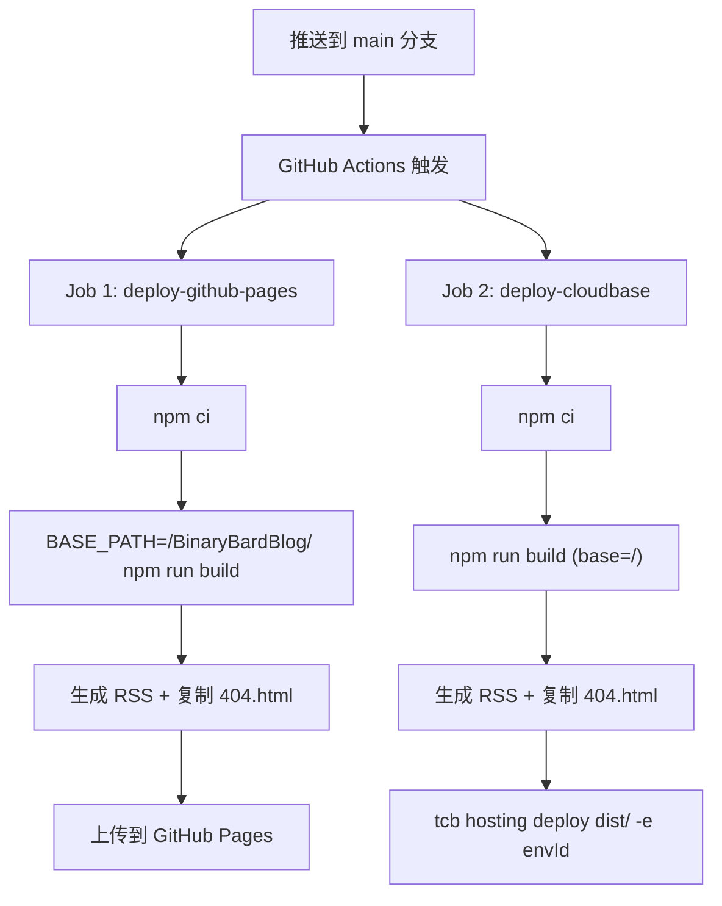

## 用户需求

将博客项目配置为 GitHub 与腾讯云 CloudBase 双平台自动部署：代码托管在 GitHub，推送后通过 GitHub Actions 同时部署到 GitHub Pages 和腾讯云 CloudBase 静态网站托管。

## 产品概述

一个 React + Vite 构建的静态博客站点，代码存放在 GitHub 仓库 `BinaryBard996/BinaryBardBlog`，推送 main 分支后自动触发 CI/CD，分别构建并部署到两个平台：

- GitHub Pages（访问地址：`https://BinaryBard996.github.io/BinaryBardBlog/`）
- 腾讯云 CloudBase 静态托管（访问地址：`https://binary-bard-blog-8fvf1sg82895f0b-1404499502.tcloudbaseapp.com/`）

## 核心功能

1. **双平台自动部署**：推送 main 分支后，GitHub Actions 自动构建并同时部署到 GitHub Pages 和腾讯云 CloudBase
2. **动态 base path**：GitHub Pages 部署使用 `/BinaryBardBlog/` 子路径，CloudBase 部署使用 `/` 根路径，通过环境变量 `BASE_PATH` 区分
3. **SPA 路由兼容**：两个平台都需要处理 SPA 404 回退（复制 index.html 为 404.html）
4. **RSS 生成**：构建时自动生成 RSS 订阅文件
5. **Giscus 评论配置**：评论组件指向正确的 GitHub 仓库

## 技术栈

- 前端框架：React 18 + TypeScript 5 + Vite 5
- 样式：TailwindCSS 3.4 + shadcn/ui
- CI/CD：GitHub Actions
- 托管平台：GitHub Pages + 腾讯云 CloudBase 静态网站托管
- CloudBase 部署工具：`@cloudbase/cli`（在 GitHub Actions 中使用）

## 实现方案

### 整体策略

通过一个 GitHub Actions workflow 文件定义两个独立的构建-部署 job，分别面向 GitHub Pages 和腾讯云 CloudBase。两个 job 并行执行，互不影响。核心差异在于 Vite 的 `base` 配置：通过环境变量 `BASE_PATH` 控制，GitHub Pages 构建时设为 `/BinaryBardBlog/`，CloudBase 构建时使用默认 `/`。

### 关键技术决策

1. **动态 base path 方案**：`vite.config.ts` 改为函数式配置，读取 `process.env.BASE_PATH`。开发模式固定 `/`，生产构建由环境变量决定。这样同一份代码可以为两个平台产出不同 base path 的构建产物。

2. **BrowserRouter basename 联动**：`App.tsx` 中的 `BrowserRouter` 需要设置 `basename` 与 Vite 的 `base` 保持一致，否则 GitHub Pages 子路径下路由会全部 404。通过 `import.meta.env.BASE_URL` 获取 Vite 注入的 base 值。

3. **CloudBase 部署方式**：在 GitHub Actions 中使用 `@cloudbase/cli` 的 `tcb hosting deploy` 命令直接上传 `dist` 目录到静态网站托管，避免依赖 CloudBase Framework 的完整构建流程（因为构建已由前一步完成）。需要在 GitHub 仓库 Secrets 中配置 `TCB_SECRET_ID` 和 `TCB_SECRET_KEY`。

4. **RSS 脚本 SITE_URL**：改为从环境变量读取，两个平台构建时传入各自的站点地址。

### 部署架构



## 实现注意事项

1. **BrowserRouter basename**：这是最关键的兼容点。GitHub Pages 子路径部署如果 `BrowserRouter` 没有设置 `basename`，所有前端路由都会 404。使用 `import.meta.env.BASE_URL` 可以自动与 Vite 的 `base` 配置同步。
2. **404 回退**：GitHub Pages 不支持 SPA 路由重写，通过 `cp dist/index.html dist/404.html` 实现回退。CloudBase 静态托管已内置此功能，但额外复制不影响。
3. **腾讯云密钥安全**：`TCB_SECRET_ID` 和 `TCB_SECRET_KEY` 必须配置为 GitHub Repository Secrets，不可明文写入 workflow 文件。建议使用子账号 API 密钥，仅授予 CloudBase 静态托管权限。
4. **并行构建**：两个 job 无依赖关系，可并行执行，总部署时间等于较慢的那个 job。

## 目录结构

```
f:/Project/BinaryBardBlog/
├── .github/
│   └── workflows/
│       └── deploy.yml          # [NEW] GitHub Actions 工作流，包含两个 job：deploy-github-pages 和 deploy-cloudbase。GitHub Pages job 使用 BASE_PATH=/BinaryBardBlog/ 构建并通过 actions/deploy-pages 部署；CloudBase job 使用默认 base 构建并通过 @cloudbase/cli 上传到静态托管。
├── src/
│   ├── App.tsx                 # [MODIFY] BrowserRouter 添加 basename={import.meta.env.BASE_URL} 属性，确保前端路由在子路径下正常工作。
│   └── types/
│       └── blog.ts             # [MODIFY] siteConfig.url 更新为 CloudBase 托管域名（主站地址）。
├── scripts/
│   └── generate-rss.ts         # [MODIFY] SITE_URL 改为从环境变量 SITE_URL 读取，支持两个平台传入不同地址。
├── vite.config.ts              # [MODIFY] 改为函数式配置，base 从 process.env.BASE_PATH 环境变量读取，开发模式固定为 "/"。
├── cloudbaserc.json            # [KEEP] 保留作为本地 CloudBase CLI 配置参考，不影响 GitHub Actions 部署。
└── src/components/blog/
    └── Comments.tsx            # [MODIFY] data-repo 更新为 "BinaryBard996/BinaryBardBlog"。
```

## 关键代码结构

```typescript
// vite.config.ts - 函数式配置支持动态 base
export default defineConfig(({ command }) => ({
  base: command === "serve" ? "/" : (process.env.BASE_PATH || "/"),
  // ... 其余配置不变
}))
```

```typescript
// App.tsx - BrowserRouter basename 联动
<BrowserRouter basename={import.meta.env.BASE_URL}>
```

## Agent Extensions

### Integration

- **tcb**
- 用途：部署完成后验证 CloudBase 环境状态和静态托管配置是否正常
- 预期结果：确认环境 ID 和静态托管域名正确，确保配置文件中的信息与实际环境一致

### SubAgent

- **code-explorer**
- 用途：探索项目中是否有其他引用了 base path 或站点 URL 的文件需要同步修改
- 预期结果：确保不遗漏任何需要修改的文件