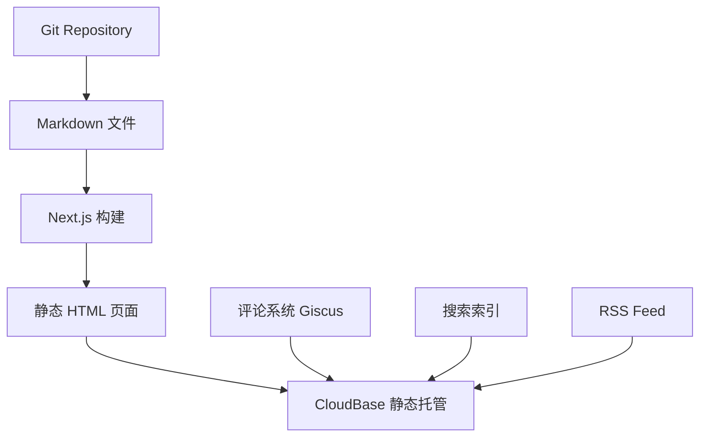
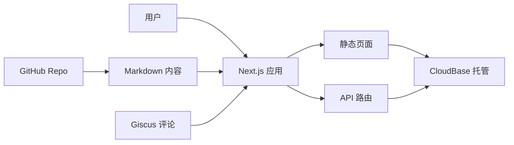

## 用户需求

创建并发布个人技术博客，实现完整的博客功能和内容管理系统。

## 产品概述

一个现代化的个人技术博客平台，支持 Markdown 写作、Git 工作流管理内容，并部署到腾讯云 CloudBase 平台，为技术分享提供优质的阅读和写作体验。

## 核心功能

- 文章展示和分类管理：支持按分类浏览文章，提供清晰的内容组织结构
- 全文搜索功能：快速检索文章内容，提升用户查找效率
- 评论互动系统：支持读者评论和互动，增强社区氛围
- RSS 订阅支持：提供 RSS 源，方便读者订阅更新
- 访问统计分析：记录和展示博客访问数据，了解内容表现
- Git 工作流集成：通过 Git 管理文章内容，支持版本控制和协作
- 代码高亮显示：针对技术博客优化的代码展示效果
- 响应式设计：适配桌面和移动设备的阅读体验

## 技术栈选择

### 前端技术栈

- **框架**: Next.js 14 (App Router) + React 18 + TypeScript
- **样式方案**: Tailwind CSS + shadcn/ui 组件库
- **内容处理**: MDX (Markdown + JSX) + gray-matter
- **代码高亮**: Prism.js / highlight.js
- **搜索功能**: Flexsearch (客户端全文搜索)
- **图标系统**: Lucide React

### 后端与部署

- **部署平台**: 腾讯云 CloudBase (静态网站托管 + 云函数)
- **评论系统**: Giscus (基于 GitHub Discussions)
- **统计分析**: 百度统计 / Google Analytics
- **RSS 生成**: feed 库自动生成 RSS XML

### 开发工具

- **包管理**: pnpm
- **代码规范**: ESLint + Prettier
- **Git 工作流**: Conventional Commits

## 实现方案

### 技术架构

采用 JAMstack 架构模式，结合静态生成 (SSG) 和增量静态再生 (ISR) 技术：



### 核心实现策略

1. **内容管理**: 使用 `content` 目录存储 Markdown 文件，通过 gray-matter 解析 frontmatter 元数据
2. **静态生成**: 利用 Next.js 的 `generateStaticParams` 和 `generateMetadata` 实现 SEO 优化
3. **搜索功能**: 构建时生成搜索索引，使用 Flexsearch 提供快速客户端搜索
4. **评论系统**: 集成 Giscus，利用 GitHub Discussions 作为评论后端
5. **RSS 订阅**: 构建时自动生成 RSS XML 文件
6. **性能优化**: 图片优化、代码分割、缓存策略

### 实现细节

- **SEO 优化**: 自动生成 sitemap.xml、robots.txt，支持 Open Graph 和 Twitter Cards
- **代码高亮**: 支持多种编程语言语法高亮，行号显示，代码复制功能
- **响应式设计**: 移动端优先设计，适配各种屏幕尺寸
- **深色模式**: 支持系统主题自动切换和手动切换
- **加载性能**: 图片懒加载、字体优化、资源预加载

## 架构设计

### 系统架构



### 目录结构

```
BinaryBardBlog/
├── src/
│   ├── app/                    # Next.js App Router 页面
│   │   ├── (blog)/            # 博客相关页面组
│   │   │   ├── page.tsx       # 首页 - 文章列表
│   │   │   ├── about/         # 关于页面
│   │   │   ├── posts/         # 文章详情页面
│   │   │   └── categories/    # 分类页面
│   │   ├── api/               # API 路由
│   │   │   ├── search/        # 搜索 API
│   │   │   └── rss/           # RSS 生成 API
│   │   ├── globals.css        # 全局样式
│   │   └── layout.tsx         # 根布局
│   ├── components/            # React 组件
│   │   ├── ui/               # shadcn/ui 基础组件
│   │   ├── blog/             # 博客特定组件
│   │   │   ├── PostCard.tsx  # 文章卡片组件
│   │   │   ├── PostContent.tsx # 文章内容组件
│   │   │   ├── SearchBox.tsx # 搜索框组件
│   │   │   └── Comments.tsx  # 评论组件
│   │   └── layout/           # 布局组件
│   │       ├── Header.tsx    # 头部导航
│   │       ├── Footer.tsx    # 页脚
│   │       └── Sidebar.tsx   # 侧边栏
│   ├── lib/                  # 工具库
│   │   ├── posts.ts         # 文章数据处理
│   │   ├── search.ts        # 搜索功能
│   │   ├── rss.ts           # RSS 生成
│   │   └── utils.ts         # 通用工具函数
│   └── types/               # TypeScript 类型定义
│       └── blog.ts          # 博客相关类型
├── content/                 # Markdown 文章内容
│   └── posts/              # 博客文章
├── public/                 # 静态资源
│   ├── images/            # 图片资源
│   └── icons/             # 图标文件
├── cloudbaserc.json       # CloudBase 配置
├── next.config.js         # Next.js 配置
├── tailwind.config.js     # Tailwind CSS 配置
├── tsconfig.json          # TypeScript 配置
└── package.json           # 项目依赖
```

### 关键代码结构

**文章数据类型定义**:

```typescript
interface BlogPost {
  slug: string
  title: string
  description: string
  date: string
  category: string
  tags: string[]
  content: string
  readingTime: number
}
```

**搜索索引接口**:

```typescript
interface SearchIndex {
  id: string
  title: string
  content: string
  category: string
  tags: string[]
  url: string
}
```

## 设计理念

采用技术博客专用的现代化设计风格，注重代码展示效果和阅读体验。整体设计以简洁、专业、高效为核心，突出内容的可读性和技术感。

## 页面设计规划

### 首页 (文章列表页)

- **顶部导航栏**: Logo、主导航菜单(首页/分类/关于/搜索)、深色模式切换按钮
- **英雄区块**: 个人简介、头像、社交链接，采用渐变背景和微动效
- **文章列表区**: 卡片式布局展示文章，包含标题、摘要、发布时间、分类标签、阅读时间
- **侧边栏**: 分类导航、标签云、最新文章、RSS 订阅链接
- **页脚**: 版权信息、友情链接、统计信息

### 文章详情页

- **文章头部**: 标题、发布时间、分类、标签、阅读时间、分享按钮
- **文章内容区**: Markdown 渲染，代码高亮，图片优化显示
- **目录导航**: 浮动式目录，支持锚点跳转和阅读进度指示
- **评论区域**: Giscus 评论系统集成
- **相关文章**: 推荐相关内容

### 分类页面

- **分类标题**: 当前分类名称和文章数量
- **文章列表**: 该分类下的所有文章，支持时间排序
- **分类导航**: 所有分类的快速切换

### 搜索页面

- **搜索框**: 实时搜索，支持关键词高亮
- **搜索结果**: 匹配的文章列表，显示匹配度和关键词位置
- **搜索建议**: 热门搜索词和搜索历史

## 视觉设计特色

- **代码友好**: 优化的代码块样式，支持多种主题，行号显示，一键复制
- **排版优化**: 针对技术文章的行间距、字体大小、段落间距优化
- **响应式布局**: 移动端优先，平板和桌面端适配
- **深色模式**: 护眼的深色主题，代码高亮适配
- **微交互**: 悬停效果、加载动画、滚动动效提升用户体验

## 推荐的代理扩展

### SubAgent

- **code-explorer**
- 目的: 在项目开发过程中探索和分析 Next.js 生态系统的最佳实践，研究类似技术博客项目的代码结构和实现模式
- 预期结果: 获得经过验证的代码架构方案和组件设计模式，确保项目采用业界最佳实践

### Skill

- **skill-creator**
- 目的: 创建专门的博客内容管理技能，用于自动化文章发布、SEO 优化和内容质量检查等工作流
- 预期结果: 建立高效的内容创作和发布流程，提升博客维护效率