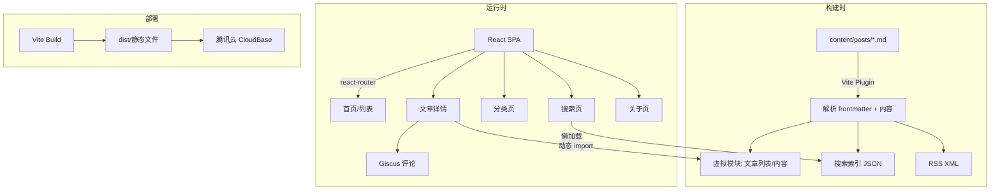
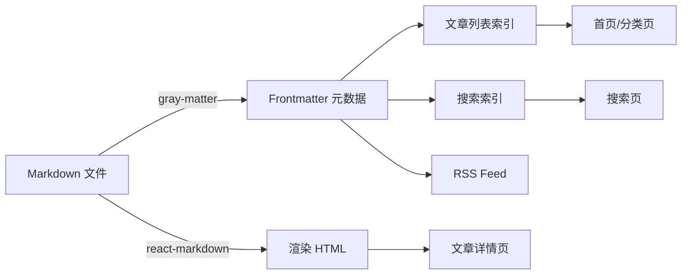

## 用户需求

创建并发布名为 BinaryBardBlog 的个人技术博客网站，从零开始构建完整项目。

## 产品概述

一个面向技术分享的现代化个人博客平台，采用 Markdown 文件 + Git 工作流管理内容，部署到腾讯云 CloudBase，为技术写作提供优质的代码展示和阅读体验。

## 核心功能

- **文章展示与分类**：文章卡片列表展示，支持按分类浏览，清晰的内容组织
- **全文搜索**：客户端实时搜索，关键词高亮，快速检索文章
- **评论系统**：集成 Giscus（基于 GitHub Discussions），支持读者互动
- **RSS 订阅**：构建时自动生成 RSS XML 文件，方便读者订阅
- **访问统计**：集成百度统计，了解博客流量和内容表现
- **代码高亮**：多语言语法高亮、行号显示、一键复制，技术博客核心体验
- **深色/浅色模式**：支持主题切换，护眼阅读
- **响应式设计**：移动端和桌面端完整适配
- **目录导航**：文章详情页浮动目录，锚点跳转
- **SEO 优化**：自动生成 sitemap、Open Graph 元标签

## 技术栈

- **构建工具**: Vite 5
- **前端框架**: React 18 + TypeScript 5
- **路由**: react-router-dom v6（SPA 客户端路由）
- **样式方案**: Tailwind CSS 3.4.17 + tailwind-merge + tailwindcss-animate
- **组件库**: shadcn/ui
- **图标**: lucide-react + react-icons
- **Markdown 渲染**: react-markdown + remark-gfm + rehype-highlight + rehype-slug + rehype-autolink-headings
- **Frontmatter 解析**: gray-matter
- **代码高亮**: highlight.js（配合 rehype-highlight）
- **搜索引擎**: flexsearch（客户端全文搜索）
- **评论系统**: Giscus（基于 GitHub Discussions）
- **访问统计**: 百度统计
- **RSS 生成**: 构建时 Node.js 脚本 + feed 库
- **字体**: Inter（Google Fonts）
- **部署**: 腾讯云 CloudBase 静态站点托管

## 实现方案

### 整体策略

采用 Vite + React SPA 架构，结合构建时预处理方案。Markdown 文件存放在 `content/posts/` 目录，通过自定义 Vite 插件在构建时将所有 Markdown 解析为 JSON 数据（文章列表索引 + 全文内容），生成搜索索引和 RSS feed。运行时通过懒加载按需获取文章内容。

### 关键技术决策

1. **Vite 虚拟模块插件**：编写自定义 Vite 插件 `vite-plugin-blog`，在构建时扫描 `content/posts/` 目录，解析 Markdown frontmatter，生成虚拟模块 `virtual:blog-posts`（文章列表元数据）和 `virtual:blog-post-{slug}`（单篇文章内容）。开发模式下支持 HMR 热更新。
2. **客户端路由 + 预加载**：使用 react-router-dom 实现 SPA 路由，文章详情页通过动态 import 按需加载内容，首页预加载可见文章的内容提升体验。
3. **搜索方案**：构建时将文章标题、摘要、标签等元数据预生成 JSON 索引文件，运行时用 flexsearch 加载索引并提供即时搜索。
4. **RSS 生成**：在 `vite build` 的 `closeBundle` 钩子中，用 feed 库生成 `dist/rss.xml`。
5. **主题切换**：使用 CSS 变量 + Tailwind dark mode（class 策略），状态持久化到 localStorage。

### 性能考量

- 文章内容按需加载（代码分割），避免首屏加载全部文章
- 搜索索引懒加载，仅在用户打开搜索时初始化 flexsearch
- 图片懒加载（Intersection Observer）
- Tailwind CSS purge 确保最小 CSS 体积
- highlight.js 按需注册语言包，避免加载全部语言

### 实现注意事项

- Vite 配置需设置 `server.host: '0.0.0.0'` 和 `server.allowedHosts: true`
- `tsconfig.app.json` 需设 `verbatimModuleSyntax: false`
- 每个文件不超过 300 行，大组件拆分为子组件
- SPA 部署时需配置 CloudBase 的 URL 重写规则（所有路由指向 index.html）
- Giscus 配置需要用户后续在 GitHub 仓库开启 Discussions 功能

## 架构设计

### 系统架构



### 数据流



## 目录结构

```
BinaryBardBlog/
├── content/
│   └── posts/                          # [NEW] Markdown 文章目录
│       ├── hello-world.md              # [NEW] 示例文章，包含完整 frontmatter 演示
│       └── getting-started-with-react.md # [NEW] 示例文章，演示代码高亮功能
├── scripts/
│   └── generate-rss.ts                 # [NEW] RSS 生成脚本，构建后生成 dist/rss.xml
├── src/
│   ├── plugins/
│   │   └── vite-plugin-blog.ts         # [NEW] 自定义 Vite 插件，扫描 content/posts 解析 Markdown，提供虚拟模块 virtual:blog-posts 和 virtual:blog-post-{slug}，生成搜索索引 JSON
│   ├── types/
│   │   └── blog.ts                     # [NEW] 博客核心类型定义：BlogPost、PostMeta、SearchResult、Category 等接口
│   ├── lib/
│   │   ├── utils.ts                    # [NEW] 通用工具函数：cn()（tailwind-merge）、formatDate、calculateReadingTime
│   │   ├── posts.ts                    # [NEW] 文章数据操作：获取文章列表、按分类筛选、按标签筛选、排序、获取相关文章
│   │   ├── search.ts                   # [NEW] 搜索模块：初始化 flexsearch 索引、加载搜索数据、执行搜索、高亮关键词
│   │   └── toc.ts                      # [NEW] 目录提取：从 Markdown 内容中提取标题层级生成 TOC 数据结构
│   ├── hooks/
│   │   ├── useTheme.ts                 # [NEW] 主题切换 Hook：深色/浅色模式切换，localStorage 持久化，系统主题监听
│   │   ├── useSearch.ts                # [NEW] 搜索 Hook：管理搜索状态、防抖输入、调用 flexsearch 返回结果
│   │   └── useScrollSpy.ts            # [NEW] 滚动监听 Hook：监听标题元素可见性，高亮当前目录项
│   ├── components/
│   │   ├── ui/                         # [NEW] shadcn/ui 基础组件目录（button, card, input, badge, separator 等）
│   │   ├── layout/
│   │   │   ├── Header.tsx              # [NEW] 顶部导航栏：Logo、导航菜单、搜索入口、主题切换按钮、移动端汉堡菜单
│   │   │   ├── Footer.tsx              # [NEW] 页脚：版权信息、社交链接、RSS 链接、站点统计
│   │   │   ├── Sidebar.tsx             # [NEW] 侧边栏：分类列表、标签云、最新文章、RSS 订阅卡片
│   │   │   └── Layout.tsx              # [NEW] 页面整体布局容器：Header + main content + Sidebar + Footer，响应式布局
│   │   └── blog/
│   │       ├── PostCard.tsx            # [NEW] 文章卡片：封面图、标题、摘要、日期、分类标签、阅读时间，悬停动效
│   │       ├── PostList.tsx            # [NEW] 文章列表：卡片网格布局、分页逻辑、空状态处理
│   │       ├── PostContent.tsx         # [NEW] 文章内容渲染：react-markdown 渲染、代码高亮、图片优化、自定义组件映射
│   │       ├── CodeBlock.tsx           # [NEW] 代码块组件：语言标签、行号显示、一键复制按钮、highlight.js 主题
│   │       ├── TableOfContents.tsx     # [NEW] 目录导航：浮动目录、层级缩进、当前阅读位置高亮、平滑滚动
│   │       ├── Comments.tsx            # [NEW] 评论组件：Giscus 集成封装、主题适配、懒加载
│   │       ├── SearchDialog.tsx        # [NEW] 搜索对话框：模态搜索框、实时结果、关键词高亮、快捷键支持(Cmd+K)
│   │       ├── CategoryList.tsx        # [NEW] 分类列表组件：分类名称、文章数量、选中态样式
│   │       ├── TagCloud.tsx            # [NEW] 标签云组件：标签展示、大小根据文章数变化、点击筛选
│   │       └── RelatedPosts.tsx        # [NEW] 相关文章推荐：基于分类和标签匹配的推荐列表
│   ├── pages/
│   │   ├── HomePage.tsx                # [NEW] 首页：Hero 区域（个人介绍+渐变背景）+ 文章列表 + 侧边栏
│   │   ├── PostPage.tsx                # [NEW] 文章详情页：文章头部信息 + Markdown 内容 + 目录 + 评论 + 相关文章
│   │   ├── CategoryPage.tsx            # [NEW] 分类页面：分类导航 + 该分类下文章列表
│   │   ├── SearchPage.tsx              # [NEW] 搜索页面：搜索框 + 搜索结果列表 + 搜索建议
│   │   └── AboutPage.tsx               # [NEW] 关于页面：个人简介、技能栈、社交链接、博客故事
│   ├── App.tsx                         # [NEW] 应用根组件：路由配置、ThemeProvider、全局布局
│   ├── main.tsx                        # [NEW] 应用入口：ReactDOM 渲染、百度统计脚本注入
│   ├── index.css                       # [NEW] 全局样式：Tailwind 指令、CSS 变量（主题色、间距）、highlight.js 主题、自定义排版样式
│   └── vite-env.d.ts                   # [NEW] Vite 类型声明：虚拟模块类型声明
├── public/
│   ├── images/                         # [NEW] 静态图片资源目录
│   │   └── avatar.png                  # [NEW] 博主头像占位图
│   └── favicon.svg                     # [NEW] 站点图标
├── index.html                          # [NEW] HTML 入口模板：Inter 字体引入、meta 标签、百度统计代码
├── vite.config.ts                      # [NEW] Vite 配置：自定义博客插件注册、路径别名(@/)、server 配置(host/allowedHosts)、构建优化
├── tailwind.config.js                  # [NEW] Tailwind 配置：自定义主题色(#2563eb 蓝色系)、Inter 字体、深色模式 class 策略、动画扩展
├── postcss.config.js                   # [NEW] PostCSS 配置：Tailwind CSS + autoprefixer
├── tsconfig.json                       # [NEW] TypeScript 根配置
├── tsconfig.app.json                   # [NEW] TypeScript 应用配置：verbatimModuleSyntax: false、路径别名
├── tsconfig.node.json                  # [NEW] TypeScript Node 配置（Vite 插件和脚本）
├── cloudbaserc.json                    # [NEW] 腾讯云 CloudBase 配置：静态站点托管、URL 重写规则（SPA 支持）
├── components.json                     # [NEW] shadcn/ui 配置文件
├── package.json                        # [NEW] 项目依赖和脚本定义
├── .gitignore                          # [NEW] Git 忽略配置
└── README.md                           # [NEW] 项目说明文档：本地开发、文章编写指南、部署步骤
```

## 关键代码结构

**博客核心类型定义** (`src/types/blog.ts`):

```typescript
export interface PostMeta {
  slug: string;
  title: string;
  description: string;
  date: string;
  category: string;
  tags: string[];
  cover?: string;
  readingTime: number;
}

export interface BlogPost extends PostMeta {
  content: string;
}

export interface TOCItem {
  id: string;
  text: string;
  level: number;
}

export interface SearchResult {
  slug: string;
  title: string;
  description: string;
  category: string;
  matches: string[];
}
```

**Vite 虚拟模块声明** (`src/vite-env.d.ts`):

```typescript
declare module 'virtual:blog-posts' {
  import type { PostMeta } from '@/types/blog';
  const posts: PostMeta[];
  export default posts;
}

declare module 'virtual:blog-post-*' {
  import type { BlogPost } from '@/types/blog';
  const post: BlogPost;
  export default post;
}

declare module 'virtual:search-index' {
  interface SearchEntry {
    slug: string;
    title: string;
    description: string;
    content: string;
    category: string;
    tags: string[];
  }
  const index: SearchEntry[];
  export default index;
}
```

## 设计风格

采用现代技术博客风格，以深蓝色为主色调，强调代码展示效果和技术内容的可读性。整体设计干净利落，注重留白和层次感，使用 glassmorphism 效果和微动画提升高级感。

## 页面设计

### 首页

- **顶部导航栏**：固定顶部，左侧 Logo（BinaryBard 字标+图标），中部导航菜单（首页/分类/关于），右侧搜索图标按钮（点击弹出 Cmd+K 搜索框）和深色模式切换按钮。导航栏采用毛玻璃背景（backdrop-blur），滚动时添加底部阴影。
- **Hero 区域**：全宽渐变背景（从深蓝到浅蓝），左侧展示博主信息（头像圆形、姓名、一句话简介、社交图标链接），右侧展示代码风格的装饰性动画元素（终端窗口造型），整体营造技术感氛围。
- **文章列表区域**：主内容区占 2/3 宽度，文章以卡片形式纵向排列。每张卡片包含：左侧封面缩略图、右侧标题+摘要+底部元信息（日期、分类标签、阅读时间）。卡片悬停时微上浮并加深阴影。支持分页加载。
- **右侧边栏**：占 1/3 宽度，包含分类导航卡片（列表形式，显示文章数）、标签云卡片（彩色标签按钮）、最新文章卡片（标题列表+日期）、RSS 订阅卡片（橙色图标+订阅按钮）。
- **页脚**：深色背景，三列布局：左侧站点信息和版权、中间快速链接、右侧社交链接图标。

### 文章详情页

- **文章头部**：全宽区域，渐变背景，展示标题（大号加粗）、发布日期、分类标签（Badge 样式）、标签列表、预计阅读时间。
- **内容区域**：左侧主内容区展示 Markdown 渲染后的文章内容。代码块采用深色主题（atom-one-dark），带语言标签、行号和复制按钮。段落间距适中，行高 1.75，适合长文阅读。图片居中显示带圆角阴影。
- **右侧浮动目录**：sticky 定位，展示文章标题层级（H2/H3），当前阅读位置高亮（蓝色左边框），点击平滑滚动。
- **评论区域**：文章底部集成 Giscus 评论，自动适配深色/浅色主题。
- **相关文章**：文章底部水平卡片列表，展示 2-3 篇相关文章。

### 分类页面

- **分类导航**：顶部横向标签按钮组，当前分类高亮，支持"全部"选项。
- **文章列表**：该分类下文章以时间线形式或卡片列表展示。
- **空状态**：分类无文章时展示友好的空状态插图和提示。

### 搜索页面

- **搜索对话框**：模态框形式弹出，顶部大搜索输入框带搜索图标，支持 Cmd+K 全局快捷键唤起。输入时实时显示搜索结果，关键词黄色高亮。结果项显示标题、摘要片段、分类。无结果时显示友好提示。

### 关于页面

- **个人介绍区**：头像、姓名、职位、个人简介段落，社交链接按钮组。
- **技能展示**：技能标签网格，按类别分组（前端/后端/工具等），每个标签带图标。
- **博客故事**：时间线形式展示博客历程或个人经历。

## Agent Extensions

### SubAgent

- **code-explorer**
- 目的：在实现 Vite 自定义插件和博客内容处理系统时，探索项目文件结构，验证模块依赖关系和导入路径的正确性
- 预期结果：确保 Vite 插件、虚拟模块、组件间引用关系准确无误，避免构建错误