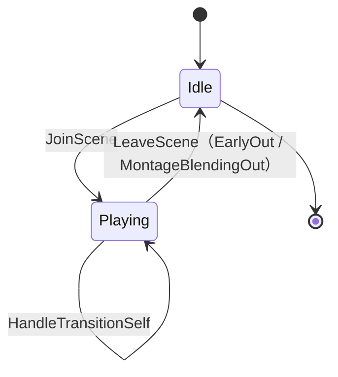
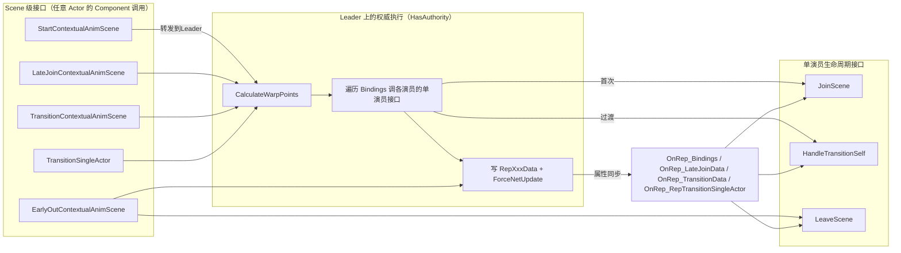
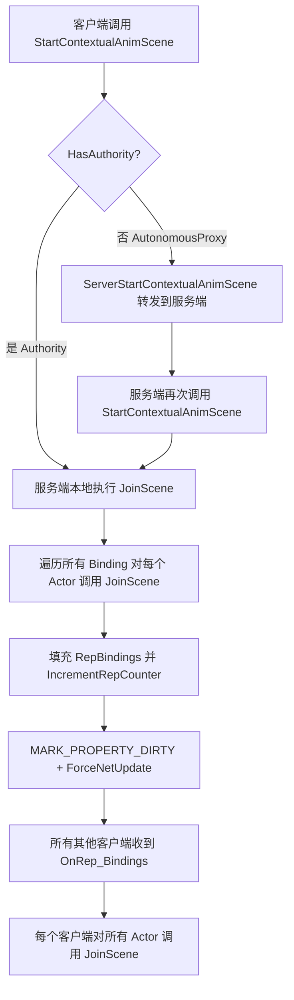

## 一、引言

最近让AI给我搜索UE5新增的插件，和Gameplay相关的，除了上一篇的TargetSystem，还有别的，比如这篇文章要介绍的ContextualAnimation插件。

开宗明义，这个插件要解决的核心问题是：**多角色的交互动画**。典型的场景比如处决动画，可交互物体，双人协作开门等。这类需求有以下三个共同的特征：

- 参与者不止一个，需要在时间上同步，使动作对的上节拍。
- 参与者在空间上需要按照预设的位置对齐。
- 表演过程需要考虑网络同步。

ContextualAnimation插件就是解决上述几个问题的，期望提供一个通用的多角色交互动画框架。不过大致浏览了代码，个人感觉这个插件一般般，很多东西很临时，用起来比较别扭。适合作为交互动画、处决动画等的实现思路，如果要构建项目的多角色交互动画框架，这个插件作为参考非常合适，但是目前无法拿来直接使用。

这个插件已经好几个版本没迭代过了，在不改代码的前提下，应该没办法直接使用。读源码学思路，然后基于自己的需求重新组织一套，会比直接改源码舒服多了。

## 二、如何使用

首先大致介绍一下如何使用这个插件，下面是我简单制作的一个处决动画的演示视频。

使用的是这个免费的动画资源：https://www.fab.com/listings/9319491d-0e91-422c-9b67-ad4bf6c01a02

插件直接在Plugins里打开即可：


### 插件使用说明

我这里演示如何用最简单的方式，配置一个角色处决的动画。

**创建DataAsset情境动画角色资产**


设置对应的角色，处决动画分别为Attacker和Victim。Mesh的Transform参考角色蓝图的设定成一样的。


**然后创建情境动画资产**


打开刚才创建的ContextualAnimScene，配置RolesAsset：


**配置AnimSection**，这里分别给处决者和被处决选择动画，我用的是上面导入的动画资产里的 `Paired_ForceChoke_Att` 和 `Paired_ForceChoke_Vic`：


**调整一下表演的相对位置**，方便进行表演，我这里调整了被处决者的位置：


**设置MotionWarp**，我这里希望处决的时候，可以将被处决者吸附到处决者身前的位置。这里选择的模式是PrimaryActor，具体各个模式都有什么用，在后续我会进行说明。


**打开被处决动画的Montage，设置MotionWarp**：


**打开角色的蓝图，添加ContextualAnimSceneComp和MotionWarp两个组件**：


**播放情境动画**，调用函数 `UContextualAnimUtilities::BP_CreateContextualAnimSceneBindingsForTwoActors`，上面那个是处决者，下面的是被处决者。设置完后调用播放情境动画的函数即可。


运行之后就是上面视频里的效果，效果就是处决时，把目标拉到身前然后捏死。接下来讲讲我个人理解的ContextualAnim插件的设计理念和核心概念。

## 三、核心概念

在开始讲解前，我需要再次强调，这个插件代码的很多部分很临时，很多功能实际上甚至是不可用状态的。这里需要理解的是，掌握整体的设计思路和想法，收集融合到自己的项目当中去。

ContextualAnimScene和LevelSequence有相似之处，通过一个表演的脚本 `ContextualAnimSceneAsset`，来让Actors按照设计，协作进行表演——比如处决，交互动画等等。但是我个人理解，ContextualAnimScene和LevelSequence相比，更加轻量，更偏向于运行时的表现。

**LevelSequence** 的时间轴是通过SequencePlayer统一管理时间轴，统一驱动的，所有的Actors都像是被各自的Track所控制的提线木偶，在SequencePlayer的tick下严格的统一推进。

**ContextualAnimScene** 则是没有这样一个统一的管理者，只有一个领舞的Leader，让各个参与者各自调用JoinScene，独立表演，自己tick，只是通过了 `MontageSync_Follow` 函数让动画可以基于Leader去播放。插件本身只是对现有的一些功能接口（MotionWarp等）做了一层包装，更适配于网络同步和运行时的需求。

比如处决表演，那就是处决者和被处决者，各自独立播放自己的动画，自己去通过MotionWarp移动到指定的位置上去。

### 表演的剧本

对于多角色互动动画，首先需要具有一个剧本，来说明各个演员需要在什么位置，播放什么动画，各自的行为如何，因此需要有一个资产来说明这些。在ContextualAnim插件里，剧本就是 `UContextualAnimSceneAsset`，也就是上面第三步创建的。下面是最简单的说明，实际包含的数据更多，但是我认为了解各大概即可，要用的时候自己去看代码就行了。

```text
UContextualAnimSceneAsset
└── Sections[]  (FContextualAnimSceneSection)        // 场景的"段"（类似 Montage Section）
    ├── bSyncAnimations                              // 本段内是否同步各 Role 的 Montage 时间
    ├── WarpPointDefinitions[]                       // 本段用到的 WarpPoint 定义
    └── AnimSets[] (FContextualAnimSet)              // 本段下的"变体集合"
        └── Tracks[] (FContextualAnimTrack)          // 每个 Role 一条 Track
            ├── Animation (UAnimSequenceBase*)       // 本 Track 用的 Montage
            ├── MovementMode / bChangeMovementMode   // 本段内的移动模式
            ├── bControlCharacterRotation            // 禁用物理/控制器旋转
            ├── bOptional                            // Role 是否可缺席
            └── SelectionCriteria[]                  // 触发条件
```

### 单个演员的表演

有了上面基础的概念，那么首先从单个角色的接口开始讲起。核心是 `UContextualAnimSceneActorComponent` 的三个接口：

- **JoinScene** — 开始表演，这里主要做的事情就是播放动画，写入WarpTarget，改碰撞/移动状态。
- **HandleTransitionSelf** — 在同一场景下，切换到新的Section/AnimSet，去更换动画，重算WarpTarget。
- **LeaveScene** — 停止表演，停动画，清理WarpTarget，恢复移动/碰撞状态。



### 整体表演

有了单个演员的表演，接下来就需要说明ContextualAnimScene是如何组织起来的。核心是这五个接口：

**StartContextualAnimScene** — 开始表演，做的事情很简单：
- 计算MotionWarpTargets
- 遍历全部的演员，然后调用JoinScene函数，让每个演员单独开始表演。

**LateJoinContextualAnimScene** — 表演已经开始，让新角色中途加入。比如群体处决——A 正在处决 Boss，B 跑过来一起按住 Boss。这里做的事情是：
- 重新对演员进行绑定
- 计算MotionWarpTargets
- 遍历全部的演员，然后调用LateJoinScene函数，让每个演员单独开始表演。

**TransitionContextualAnimScene** — 切换表演的段落：
- 计算MotionWarpTargets
- 遍历全部演员，调用HandleTransitionSelf函数，切换各自的表演

**TransitionSingleActor** — 切换单个演员的表演段落

**EarlyOutContextualAnimScene** — 提前结束表演，这里做的是遍历全部演员，调用他们各自的结束表演接口。

整体的流程图如下：



虽然上面我一本正经的讲了这个流程，但是如果直接使用插件，会发现 `LateJoinContextualAnimScene` 中途加入新演员的函数无法生效，因为代码里要求 `CreateContextualAnimSceneBindings` 时，所有的Bindings必须都是有效的。也就是说，如果你希望有三个角色的同步动画，那么必须同时指定三个Actors都有效，才可以开始表演。哪怕你用了临时Actor去替换一个Binding先让表演开始，`LateJoinContextualAnimScene` 调用时，如果发现需要替换的演员已经存在，函数也会return。这就导致这个函数的目的，希望某个演员可以中途加入表演，压根没办法生效。

我怀疑还有很多别的功能也处于类似的无效状态，实际上压根不能生效，因此对于这个插件，还是学习一下设计思路即可，不能直接使用。

## 四、细节逻辑讲解

这里从开始表演开始，从代码层次大致分析一下逻辑。

### StartContextualAnimScene

`UContextualAnimSceneActorComponent::StartContextualAnimScene`：
- 计算出WarpPoints，可用于动画的MotionWarp
- 从Owner开始，依次播放Bindings的AnimScene
- 同步

```cpp
TArray<FContextualAnimWarpPoint> WarpPoints;
CalculateWarpPointsForBindings(InBindings, InBindings.GetSectionIdx(), InBindings.GetAnimSetIdx(), WarpPoints);
```

```cpp
JoinScene(InBindings, WarpPoints, ExternalWarpTargets);

for (const FContextualAnimSceneBinding& Binding : InBindings)
{
    if (Binding.GetActor() != GetOwner())
    {
       if (UContextualAnimSceneActorComponent* Comp = Binding.GetSceneActorComponent())
       {
          Comp->JoinScene(InBindings, WarpPoints, ExternalWarpTargets);
       }
    }
}
```

```cpp
RepBindings.Bindings = InBindings;
RepBindings.WarpPoints = MoveTemp(WarpPoints);
RepBindings.ExternalWarpTargets = ExternalWarpTargets;
RepBindings.IncrementRepCounter();

MARK_PROPERTY_DIRTY_FROM_NAME(UContextualAnimSceneActorComponent, RepBindings, this);
GetOwner()->ForceNetUpdate();
```

### JoinScene

然后跳转到情境动画当中，个人表演相关的部分。函数接口是 `UContextualAnimSceneActorComponent::JoinScene`。

这里处理的是ContextualAnimScene中，单个Bindings也就是单个演员的表演：
- 调用PlayAnimation播放对应的动画
- 更新MotionWarpTarget，写入MotionWarp组件中
- 设置碰撞状态
- 设置移动状态
- 最后来个OnJoinScene并广播

### PlayAnimation_Internal

`UContextualAnimSceneActorComponent::PlayAnimation_Internal`：

这里的逻辑比较简单，就是依据输入的动画，调用 `Montage_Play`。

```cpp
UAnimMontage* AnimMontage = Cast<UAnimMontage>(Animation);

// Keep track of this animation. Used as guarding mechanism in OnMonageBlendingOut to decide if is safe to leave the scene
AnimsPlayed.Add(AnimMontage);

AnimInstance->Montage_Play(AnimMontage, 1.f, EMontagePlayReturnType::MontageLength, StartTime);
```

如果输入 `bSyncPlaybackTime` 为true，则会尝试获取SyncLeader，通过函数 `MontageSync_Follow` 和Leader的动画播放同步。

```cpp
if (bSyncPlaybackTime)
{
    if (FAnimMontageInstance* MontageInstance = AnimInstance->GetActiveMontageInstance())
    {
       if (const FContextualAnimSceneBinding* SyncLeader = Bindings.GetSyncLeader())
       {
          if (SyncLeader->GetActor() != GetOwner())
          {
             FAnimMontageInstance* LeaderMontageInstance = SyncLeader->GetAnimMontageInstance();
             if (LeaderMontageInstance && LeaderMontageInstance->Montage == Bindings.GetAnimTrackFromBinding(*SyncLeader).Animation && MontageInstance->GetMontageSyncLeader() == nullptr)
             {
                UE_LOG(LogContextualAnim, VeryVerbose, TEXT("%-21s \t\tUContextualAnimSceneActorComponent::PlayAnimation_Internal Syncing Animation. Actor: %s Anim: %s StartTime: %f bSyncPlaybackTime: %d"),
                   *UEnum::GetValueAsString(TEXT("Engine.ENetRole"), GetOwner()->GetLocalRole()), *GetNameSafe(GetOwner()), *GetNameSafe(Animation), StartTime, bSyncPlaybackTime);

                MontageInstance->MontageSync_Follow(LeaderMontageInstance);
             }
          }
       }
    }
}
```

这里的代码挺奇怪的，`GetSyncLeader` 函数默认是用SecondaryBinding作为Leader。这样子如果是A处决B，如果是由A的组件调用的函数播放上下文动画场景（ContextualAnimScene），那么则两者的动画都不会同步。必须要是A处决B，但是由B的组件调用函数 `StartContextualAnimScene`，才可以跑到 `MontageSync_Follow`。这个插件处处都是一些临时的痕迹，这也是我认为它并不能实用到自己的项目里，只可参考一些思路的原因。

## 五、细节探究

这个部分针对很多ContextualAnim插件的细节进行讨论。

### MotionWarpPoint如何计算

我们可以在ContextualAnimScene里配置MotionWarpTarget给动画里的MotionWarp使用，这样子就可以在情景动画播放前，将对应的演员拉到一个理想的位置。比如处决动画需要将被处决者拉到处决者的某个相对位置上。

首先计算的是WarpPoint的Transform：


MotionWarpPoint的计算函数为 `FContextualAnimSceneBindings::CalculateWarpPoint`：

**EContextualAnimWarpPointDefinitionMode::PrimaryActor** 类别，会使用PrimaryBinding的Transform作为目标位置：


`PrimaryBinding::GetTransform` 具体函数如下。默认情况下是BindingActor的Transform，但是构造Binding的时候，可以输入ExternalTransform。这个地方就可以自由的设置自己想要的目标位置了，是相对比较灵活的。


```cpp
FTransform FContextualAnimSceneBindingContext::GetTransform() const
{
    // If created with an external transform, used that one to represent the location/rotation of the actor
    if (ExternalTransform.IsSet())
    {
       return ExternalTransform.GetValue();
    }
    else if (UContextualAnimSceneActorComponent* Comp = GetSceneActorComponent())
    {
       if (AActor* OwnerActor = Comp->GetOwner())
       {
          return Comp->AlignmentOffset * OwnerActor->GetActorTransform();
       }
    }

    return FTransform::Identity;
}
```

**EContextualAnimWarpPointDefinitionMode::Socket** — 以指定的PrimaryBindingActor的Mesh Socket的Transform，作为WarpPoint的目标。

**EContextualAnimWarpPointDefinitionMode::Custom** — 以某个PrimaryBinding的Transform作为目标，同时可以指定另一个PrimaryBinding，将两者的Transform按照weight进行混合。可以认为是第一种方案的威力加强版。

最后针对每个Role的实际WarpTarget位置，还会考虑到角色相对于原点的相对Transform。具体的计算公式如下：`TransformRelativeToWarpPoint * WarpPoint.Transform`。WarpPoint.Transform是前面计算出来的世界坐标，TransformRelativeToWarpPoint是在ContextualAnimScene中配置的相对位置坐标。


```cpp
const FContextualAnimTrack& AnimTrack = Bindings.GetAnimTrackFromBinding(Binding);
const float Time = AnimTrack.GetSyncTimeForWarpSection(WarpPointDef.WarpTargetName);
const FTransform TransformRelativeToWarpPoint = Bindings.GetAlignmentTransformFromBinding(Binding, WarpPointDef.WarpTargetName, Time);
const FTransform WarpTargetTransform = TransformRelativeToWarpPoint * WarpPoint.Transform;
MotionWarpComp->AddOrUpdateWarpTargetFromTransform(WarpPoint.Name, WarpTargetTransform);
```

## 六、情境动画的网络同步

这里讨论一下，ContextualAnim插件的网络同步功能是如何实现的。就以最简单的开始情境动画/结束情境动画两个场景讨论。

### 开始表演的同步

首先依据代码，情景动画发起者为服务端，因为需要判断 `GetOwner()->HasAuthority()` 为true，对于主控端，也是通过RPC函数 `ServerStartContextualAnimScene` 发消息给服务端发起的。

情景动画的网络同步流程如下，依靠属性同步广播到客户端播放：



在函数 `UContextualAnimSceneActorComponent::StartContextualAnimScene` 中，服务端计算完需要的数据后，开始播放情景动画，然后将需要的数据写入到 `RepBindings` 后，依靠属性同步到客户端。

```cpp
RepBindings.Bindings = InBindings;
RepBindings.WarpPoints = MoveTemp(WarpPoints);
RepBindings.ExternalWarpTargets = ExternalWarpTargets;
RepBindings.IncrementRepCounter();
```

客户端收到数据后，会调用函数 `UContextualAnimSceneActorComponent::OnRep_Bindings`，逻辑只是比服务端播放情景动画少了数据计算的部分，别的是一样的。这里直接调用了单个演员的开始表演接口。

```cpp
void UContextualAnimSceneActorComponent::OnRep_Bindings()
{
   const FContextualAnimSceneBinding* OwnerBinding = RepBindings.Bindings.FindBindingByActor(GetOwner());
  // Join the scene (start playing animation, etc.)
  JoinScene(RepBindings.Bindings, RepBindings.WarpPoints, RepBindings.ExternalWarpTargets);

  for (const FContextualAnimSceneBinding& Binding : RepBindings.Bindings)
  {
     Comp->JoinScene(RepBindings.Bindings, RepBindings.WarpPoints, RepBindings.ExternalWarpTargets);
  }
}
```

### 结束表演的同步

情境动画的结束也是类似的逻辑，主动结束调用接口 `UContextualAnimSceneActorComponent::EarlyOutContextualAnimScene`，如果自然播放到结束，会调用到接口 `UContextualAnimSceneActorComponent::OnMontageBlendingOut`，在这两个函数的地方，都会设置 `RepTransitionSingleActorData`，依靠它去停止客户端的情境动画。

- `SectionIdx` 和 `AnimSetIdx` 设置为 `MAX_uint8` 通知客户端，这次的情境动画已经无效了，应该结束。
- `bStopEveryOne` 参数，决定的是只停止自己的表演，还是停止所有人的表演。

```cpp
if (GetOwner()->HasAuthority())
{
    RepTransitionSingleActorData.Id = BindingsId;
    RepTransitionSingleActorData.SectionIdx = MAX_uint8;
    RepTransitionSingleActorData.AnimSetIdx = MAX_uint8;
    RepTransitionSingleActorData.bStopEveryone = false;
    RepTransitionSingleActorData.WarpPoints.Reset();
    RepTransitionSingleActorData.ExternalWarpTargets.Reset();
    RepTransitionSingleActorData.IncrementRepCounter();
}
```

客户端收到属性同步后，调用函数 `UContextualAnimSceneActorComponent::OnRep_RepTransitionSingleActor`，这里的代码会首先判断 `SectionIdx` 和 `AnimSetIdx` 是否为 `MAX_uint8` 来判断是跳转表演，还是结束表演。如果是结束表演，则会调用 `LeaveScene` 接口去结束单个演员的表演。

```cpp
void UContextualAnimSceneActorComponent::OnRep_RepTransitionSingleActor()
{
   if (RepTransitionSingleActorData.SectionIdx != MAX_uint8 && RepTransitionSingleActorData.AnimSetIdx != MAX_uint8)
   {

   }
   else
   {
      // RepTransitionSingleActorData with invalid indices is replicated when the animation ends
      // In this case we don't want to tell everyone else to also leave the scene since there is very common for the initiator,
      // specially if is player character, to end the animation earlier for responsiveness
      // It is more likely this will do nothing since we listen to montage end also on Simulated Proxies to 'predict' the end of the interaction.
      if (RepTransitionSingleActorData.Id == Bindings.GetID())
      {
         // Ensure that all other actors stop their animations if requested.
         if (RepTransitionSingleActorData.bStopEveryone)
         {
            // @TODO: We copy bindings other we would be iterating over an array that would change in size due to LeveScene() updates the other's actor bindings.
            // This should go away once we add the concept of a manager and keep bindings in a single place
            FContextualAnimSceneBindings TempBindings = Bindings;

            for (const FContextualAnimSceneBinding& OtherBinding : TempBindings)
            {
               if (OtherBinding.GetActor() != GetOwner())
               {
                  if (UContextualAnimSceneActorComponent* Comp = OtherBinding.GetSceneActorComponent())
                  {
                     Comp->LeaveScene();
                  }
               }
            }
         }

         LeaveScene();
      }
   }
}
```

除了上述提到的两个属性，插件里定义了四个同步属性，来负责不同功能的网络同步。

| 同步结构 | 触发事件 | 客户端回调 |
| --- | --- | --- |
| `RepBindings` | `StartContextualAnimScene` | `OnRep_Bindings` → 自己 `JoinScene` 后遍历其他演员 `JoinScene` |
| `RepLateJoinData` | `LateJoinContextualAnimScene` | `OnRep_LateJoinData` → 基于已有 Bindings `BindActorToRole` 后 `LateJoinScene` |
| `RepTransitionData` | `TransitionContextualAnimScene` | `OnRep_TransitionData` → `HandleTransitionEveryone` |
| `RepTransitionSingleActorData` | `TransitionSingleActor` / `EarlyOut` / 自然结束 | `OnRep_RepTransitionSingleActor` → 有效索引走单人 Transition，无效索引走 `LeaveScene` |

## 七、总结

用于实现多角色动画系统的参考，非常不错，代码对于大多数项目来说有点冗余，适当的提取核心思路然后扩展的话，挺不错的。插件本身感觉被UE废弃了。

核心收获：
- **设计思路**：通过一个 SceneAsset（剧本）来组织多角色的协作动画，每个角色独立表演、独立驱动
- **MotionWarp 集成**：利用 MotionWarp 将角色拉到理想位置，支持多种计算模式
- **网络同步方案**：服务端计算数据并通过属性同步广播到客户端，轻量且实用
- **不建议直接使用**：插件代码有很多临时实现和不可用的功能，建议提取核心思路重新组织
