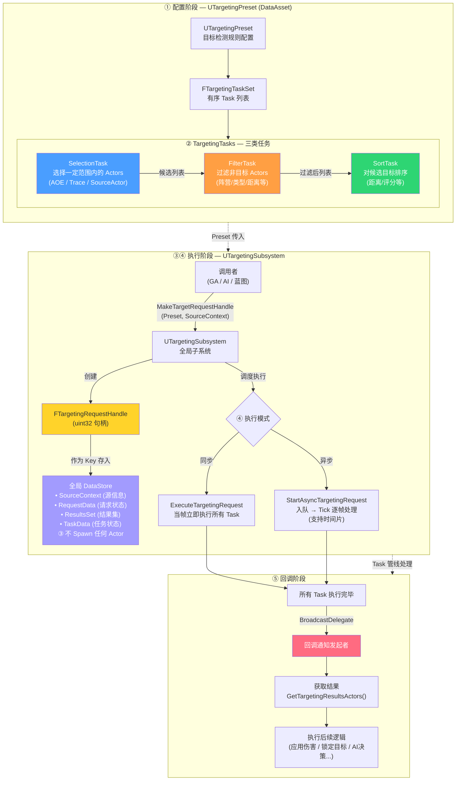

## 一、引言 — 为什么需要 TargetingSystem

在游戏开发中，"在空间中找到一组目标"是一个极其高频的需求，比如动作游戏角色攻击的打击判定。如果基于GAS开发的话，很多项目一开始都会使用TargetActor用于碰撞检测/判定。但是TargetActor作为Actor，它的创建销毁的开销比较大，随着项目的进行，往往都会优化掉TargetActor，然后基于引擎的碰撞检测逻辑如BoxTraceMulti去实现打击判定的碰撞检测逻辑。


其它系统，也有类似的"在空间中找到一组目标"需求，如：AI 需要选取最优攻击目标、拾取系统需要找到附近的物品、自动锁定需要筛选视野内的敌人……


传统做法是在每个系统中各自编写碰撞查询逻辑，然后加上各自的过滤条件，导致大量重复代码，且难以统一配置和调试。最近我翻代码的时候，发现UE5.2引入了一个新插件TargetingSystem，翻看代码过后，我认为它对"在空间中找到一组目标"这一目的，可以作为一个通用的数据驱动的目标查询框架。

它的核心思想是：将"寻找目标"这一行为抽象为一条可配置的任务管线（Task Pipeline），由 **Selection（选取）→ Filter（过滤）→ Sort（排序）** 三类任务组成，通过数据资产（DataAsset）驱动，无需编写硬编码的碰撞查询逻辑。

## 二、整体架构概览

TargetingSystem 的设计大致如下：

- 通过 `UTargetingPreset` 数据资产作为一个独立的目标检测规则，如角色的攻击判定。配置检测流程 TargetingTasks


- `TargetingTask` 为具体的目标选择逻辑，比如Overlap，Trace等，它大致可以分为**选择，过滤，排序**三种任务。可以自己实现对应的逻辑适配项目。比如玩家释放一个冲刺技能，目标是攻击距离最近的敌人。那对应的 TargetingTask 如下：
  - **SelectionTask** 选择一定范围内的 actors
  - **FilterTask** 选择敌人的怪物作为目标，过滤掉其余的 actors
  - **SortTask** 对目标候选进行排序，距离越近越优先。

- 目标检测的行为通过创建 `TargetingHandle` 在全局的 DataStore 中进行维护，**不涉及 Spawn 任何的 Actor**
- 创建的 `TargetingHandle` 由 `TargetingSubsystem` 进行管理，负责调度执行具体的目标选择逻辑。支持**同步和异步**两种执行模式。
- 目标选择逻辑执行完后，通过 Delegate 回调给发起者，执行后续的逻辑。



## 三、如何应用

有了 TargetSystem 的架构设计以后，我这里打算找一个具体的应用场景，作为使用的示例。我这里打算使用 Lyra，将它的近战攻击 `GA_Melee` 改为使用 TargetingSystem 执行。

首先打开对应的蓝图文件，可以看到近战攻击的流程如下：

1. 播放攻击动画
2. 碰撞检测找到目标
3. 对目标施加效果

TargetingSystem 可以替换的是上述的第二步，接下来分析一下近战攻击寻找目标的流程：

**通过胶囊体碰撞检测，获取角色正前方的目标**


**通过队伍系统，检测是否为敌人**


**过滤掉墙后的敌人**


按照 TargetingSystem 的架构设计，我们可以通过 TargetingTask 来复刻上述的功能。

- **TargetingSelectionTask_Melee**，使用胶囊体碰撞检测角色身前的目标，直接使用 `CapsuleTraceMultiForObjects` 接口即可
- **TargetingFilterTask_Team**，比较碰撞目标和角色的队伍，需要为敌对的
- **TargetingFilterTask_Block**，目标和角色之间，不存在墙体遮挡

具体的逻辑很简单，具体的逻辑就不写了。

有了 Task 以后，然后需要配置具体的 TargetingPreset。创建 TargetingPreset 的 DataAsset，然后配置上对应的 Task。


接下来打开 `GA_Melee`，使用 `AbilityTask-PerformTargetingRequest` 去替代原有的逻辑，`InTargetingRequest` 配置前面创建的 `DA_TP_Melee`。


逻辑完成，运行游戏按 C 键普攻测试即可。


## 四、测试代码

### UTargetingSelectionTask_Melee

```cpp
void UTargetingSelectionTask_Melee::Execute(const FTargetingRequestHandle& TargetingHandle) const
{
    FTargetingSourceContext* SourceContext = FTargetingSourceContext::Find(TargetingHandle);
    if (!SourceContext) return;

    AActor* SourceActor = SourceContext->SourceActor;
    if (!SourceActor) return;

    UWorld* World = GetSourceContextWorld(TargetingHandle);
    if (!World) return;

    FVector Direction = SourceActor->GetActorForwardVector();
    FVector Start = SourceActor->GetActorLocation();
    FVector End = Start + Direction * TraceLength;

    TArray<FHitResult> OutHits;
    UKismetSystemLibrary::CapsuleTraceMultiForObjects(World, Start, End, Radius, HalfHeight, {ObjectType}, false, {SourceActor}, EDrawDebugTrace::None, OutHits, true);

    ProcessHitResults(TargetingHandle, OutHits);

    SetTaskAsyncState(TargetingHandle, ETargetingTaskAsyncState::Completed);
}

void UTargetingSelectionTask_Melee::ProcessHitResults(const FTargetingRequestHandle& TargetingHandle, const TArray<FHitResult>& Hits) const
{
    if (TargetingHandle.IsValid() && Hits.Num() > 0)
    {
       FTargetingDefaultResultsSet& TargetingResults = FTargetingDefaultResultsSet::FindOrAdd(TargetingHandle);
       for (const FHitResult& HitResult : Hits)
       {
          if (!HitResult.GetActor())
          {
             continue;
          }

          bool bAddResult = true;
          for (const FTargetingDefaultResultData& ResultData : TargetingResults.TargetResults)
          {
             if (ResultData.HitResult.GetActor() == HitResult.GetActor())
             {
                bAddResult = false;
                break;
             }
          }

          if (bAddResult)
          {
             FTargetingDefaultResultData* ResultData = new(TargetingResults.TargetResults) FTargetingDefaultResultData();
             ResultData->HitResult = HitResult;
          }
       }
    }
}
```

### UTargetingFilterTask_Team

```cpp
bool UTargetingFilterTask_Team::ShouldFilterTarget(const FTargetingRequestHandle& TargetingHandle,
                                                   const FTargetingDefaultResultData& TargetData) const
{
    if (AActor* TargetActor = TargetData.HitResult.GetActor())
    {
       if (const FTargetingSourceContext* SourceContext = FTargetingSourceContext::Find(TargetingHandle))
       {
          if (SourceContext->SourceActor)
          {
             if (ULyraTeamSubsystem* TeamSubsystem = UWorld::GetSubsystem<ULyraTeamSubsystem>(SourceContext->SourceActor->GetWorld()))
             {
                return TeamSubsystem->CompareTeams(TargetActor, SourceContext->SourceActor) != TeamComparison;
             }
          }
       }
    }

    return true;
}
```

### UTargetingFilterTask_Block

```cpp
bool UTargetingFilterTask_Block::ShouldFilterTarget(const FTargetingRequestHandle& TargetingHandle,
                                                    const FTargetingDefaultResultData& TargetData) const
{
    if (AActor* TargetActor = TargetData.HitResult.GetActor())
    {
       if (const FTargetingSourceContext* SourceContext = FTargetingSourceContext::Find(TargetingHandle))
       {
          if (SourceContext->SourceActor)
          {
             FHitResult OutHitResult;
             TArray<AActor*> ActorsToIgnore = {SourceContext->SourceActor, TargetActor};
             return UKismetSystemLibrary::LineTraceSingle(TargetActor, SourceContext->SourceActor->GetActorLocation(), TargetData.HitResult.ImpactPoint, UEngineTypes::ConvertToTraceType(TraceChannel), false, ActorsToIgnore, EDrawDebugTrace::None, OutHitResult, true);
          }
       }
    }

    return false;
}
```
